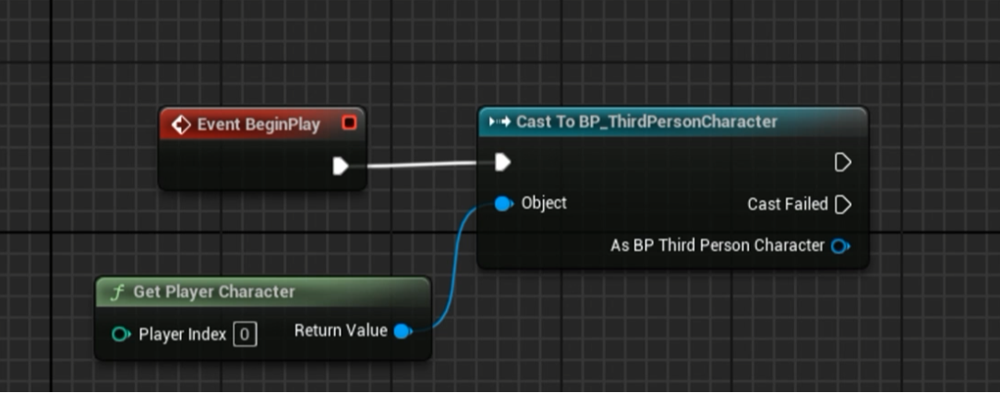
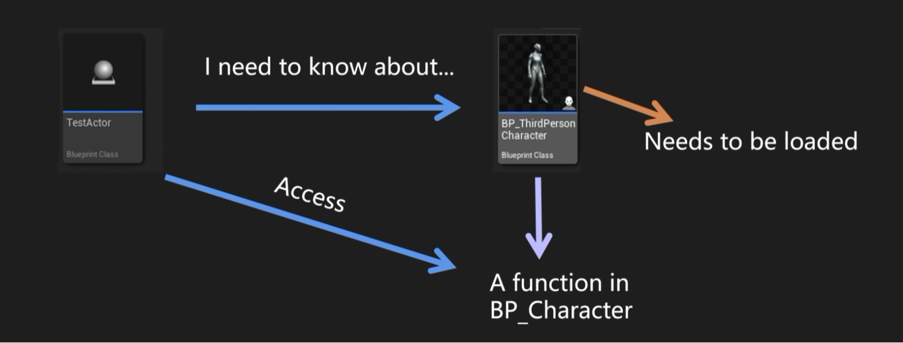
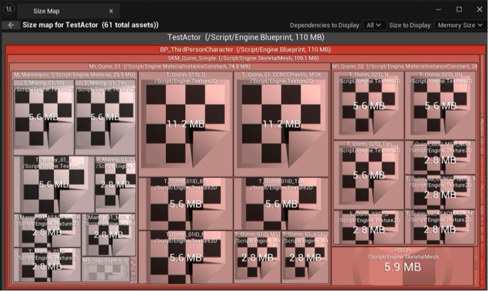
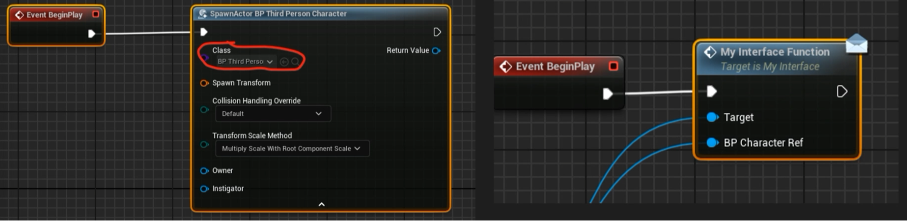
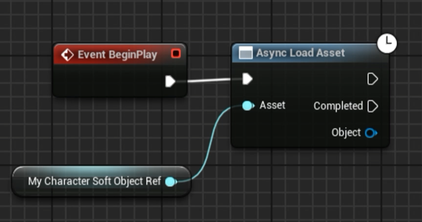

# 1. TObjectPtr

```c++
UPROPERTY()
AActor* ActorPtr; 	// old
TObjectPtr<AActor> ActorPtr;
```

`TObjectPtr` 是 UE5 推出的新特性，取代原来的成员变量指针。它只作用于成员变量，用于函数输入参数和本地变量时会直接转化成原始指针（raw pointer）。目前对成员指针变量使用 TObjectPtr 已经成为一种硬性规范。

`TObjectPtr` 支持访问追踪（Access Tracking）和延迟解析（Lazy Loading）。访问追踪让我们知道什么时候这个 Object 被使用，延迟解析只在资源被使用时进行加载，提升 Editor 的加载速度。当构建项目时，TObjectPtr 会自动转化成 raw pointer，因此它只作用于 Editor，提升开发体验，并不影响实际运行时的性能。与实际运行表现相关的是 Hard / Soft Reference。

# 2. Hard Reference

## 什么时候产生 Hard Reference

<p align="center">
  
</p>

<p align="center">
  
</p>

<p align="center">
  
</p>

在蓝图 TestActor 中 cast BP_ThirdPersonCharacter 时，BP_ThirdPersonCharacter 必须先加载以使用其函数和变量。此时打开 TestActor 的 size map 发现 BP_ThirdPersonCharacter 占据大部分内存。TestActor 加载时，BP_ThirdPersonCharacter 也会一并加载，无论是否被使用，类似情况就是 Hard Reference。每当加载一个资产时，它所依赖的所有资产也会加载到内存中，这会导致内存使用量迅速增加。

<p align="center">
  
</p>


使用类引用 `TSubclassOf<>` 、对象引用`TObjectPtr<>`或者向接口传递蓝图对象引用也会创建 Hard Reference，接口解决的是类型耦合（不必依赖具体 `UClass`），但引用强度取决于你怎么持有对象，而不是是否用了接口。如果父类拥有 Mesh, Textures，子类继承父类也会对父类的资产创建 Hard Reference。Hard Reference 的优点在于：引用简单，保证对象一定被加载。缺点是可能导致不必要的内存浪费。

## 如何避免 Hard Reference

- 在 BP parent class 中只写逻辑
- cast to native C++ 类或开销小的 BP parent class
- 避免在接口传递 BP 对象引用

# 3. Soft Reference

Soft Reference 是指向运行时设置的资产、对象或类的一种间接指针。指针只保留路径，资源在被使用时才进行加载。Soft Reference 的访问速度通常比 Hard Reference 慢，因为它们需要在运行时进行额外查找才能找到资产、对象或类。在 UE 中使用 TSoftObjectPtr、TSoftClassPtr 和 TSoftAssetPtr 创建 Soft Reference。它的优点在于可以减少不必要的内存占用，缺点是可能因为资源未加载导致冲突，以及需要注意手动加载资源。

<p align="center">
  
</p>


如何使用 Hard Ref 还是 Soft Ref 取决于对象的性质。对于关键对象应该使用 Hard Ref 确保稳定加载，不是时刻必要的对象则可以使用 Soft Ref 节省运行时的内存开销。


