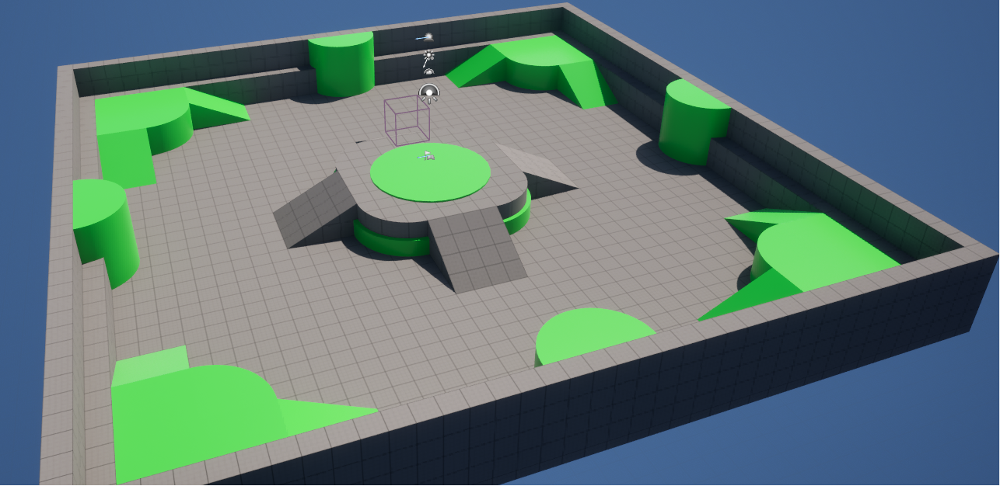
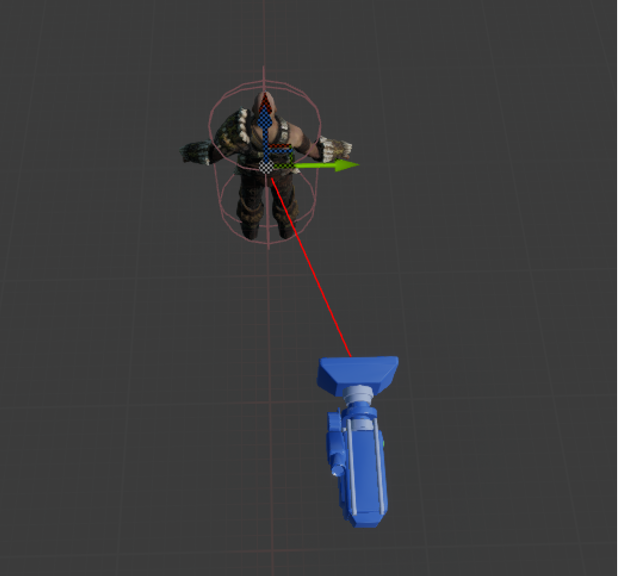
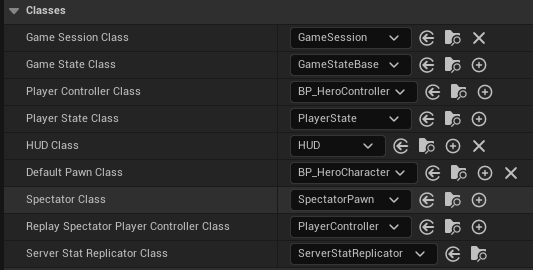
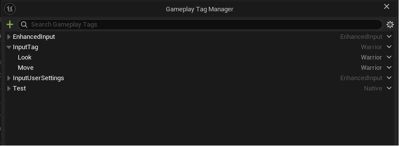
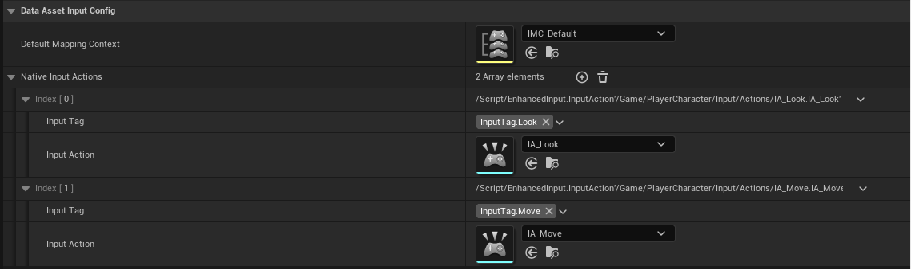

# 准备测试场景和 PlayerCharacter

创建一个新的 blank UE C++ 工程，在 Content 中加入 Third Person Pack，使用 Maps 文件夹中的地图作为开发的测试场景。在 Project Settings / Maps & Modes / Default Maps 中将 Editor Startup Map 和 Game Default Map 两项设置为该地图。

<p align="center">
  
</p>

新建一些需要的 C++ 文件和相应的蓝图，包括 WarriorBaseGameMode（继承 Game Mode Base ），GameMode 负责的是游戏规则和关卡流程，下面要修改的是其中 `DefaultPawnClass`, `PlayerControllerClass` 两个属性。当玩家加入游戏、重生，或调用 `RestartPlayer()` 时，GameMode 会按 `DefaultPawnClass` 生成一个 Pawn。玩家连接/登录后，GameMode 会为该玩家生成一个 PlayerController，负责接收输入（键鼠、手柄），控制 Pawn。生成蓝图 BP_GameModeBase，在 ProjectSetting / Maps & Modes 中将 Default GameMode 设置为 BP_GameModeBase。同时注意在 World Settings 中 GameMode 一栏将 GameMode Override 设置为 None，不然会覆盖 ProjectSettings 中的设置。

创建 WarriorBaseCharacter（继承 Character），删去不需要的函数，在 WarriorBaseCharacter 的构造函数中进行一些优化。`PrimaryActorTick` 是 UE 里 Actor 自己的 Tick 调度器，Tick 用于处理每帧逻辑。 `PrimaryActorTick` 决定这个 Actor 的 Tick 要不要跑、多久跑一遍、一开始是否启用。对于 Character 而言，移动主要由 `UCharacterMovementComponent` 负责，输入一般由 `PlayerController` 处理，再传给 Character / MovementComponent。动画主要更新在 `UAnimInstance`, `SkeletalMeshComponent`。这些核心功能不依赖 Character 自身的 Tick，都由各个组件完成，因此这里设置 `bCanEverTick` 关闭 Tick 以节省性能。设置 `bReceivesDecals` 关闭在 Character 的 Mesh 上渲染贴花，节省 Decal 渲染，避免贴花在角色身上变形。

```c++
// header file
#pragma once

#include "CoreMinimal.h"
#include "GameFramework/Character.h"
#include "WarriorBaseCharacter.generated.h"

UCLASS()
class WARRIOR_API AWarriorBaseCharacter : public ACharacter
{
	GENERATED_BODY()
public:
	// Sets default values for this character's properties
	AWarriorBaseCharacter();
};

// cpp file
// Sets default values
AWarriorBaseCharacter::AWarriorBaseCharacter()
{
 	// Set this character to call Tick() every frame.  You can turn this off to improve performance if you don't need it.
    PrimaryActorTick.bCanEverTick = false;
    PrimaryActorTick.bStartWithTickEnabled = false;
    GetMesh()->bReceivesDecals = false;
}
```

继承 WarriorBaseCharacter 创建 WarriorHeroCharacter，这是我们的主控角色，使用第三人称视角。在构造函数中创建 `SpringArmComponent`, `CameraComponent` 两个组件。`SpringArmComponent` 组件使用弹簧臂控制相机位置和距离 player 的距离，将其挂载到根节点，将相机挂载到弹簧臂上，通过 `SocketOffset` 修改相机相对弹簧臂的挂载位置。玩家输入由 `Controller` 组件处理，在第三人称视角中，可以使用鼠标移动输入改变相机观察的视角，但是角色并不随之转动，因此将 `bUseControllerRotationPitch`, `bUseControllerRotationRoll`, `bUseControllerRotationYaw` 三个属性设置为 false，修改弹簧臂 `bUsePawnControlRotation` 属性，使弹簧臂接收 `Controller` 的旋转输入。相机是弹簧臂的子节点，当弹簧臂旋转时，相机旋转也会随之改变。当角色与相机之间有物体遮挡时，弹簧臂会伸缩距离，使相机移动到遮挡物体之前以避免遮蔽。使用 `GetCharacterMovement()` 调整一些移动参数，让 Character 始终转向移动方向，`RotationRate` 控制转速，`MaxWalkSpeed` 控制移速， `BrakingDecelerationWalking` 控制移动停止时角色移速归零的速度。

<p align="center">
  
</p>


```c++
// header file
#pragma once

#include "CoreMinimal.h"
#include "Characters/WarriorBaseCharacter.h"
#include "WarriorHeroCharacter.generated.h"

class USpringArmComponent;
class UCameraComponent;

UCLASS()
class WARRIOR_API AWarriorHeroCharacter : public AWarriorBaseCharacter
{
	GENERATED_BODY()
public:
	AWarriorHeroCharacter();
private:

#pragma region Components
	UPROPERTY(VisibleAnywhere, BlueprintReadOnly, Category = "Camera", meta = (AllowPrivateAccess = "true"))
	TObjectPtr<USpringArmComponent> CameraBoom;

	UPROPERTY(VisibleAnywhere, BlueprintReadOnly, Category = "Camera", meta = (AllowPrivateAccess = "true"))
	TObjectPtr<UCameraComponent> FollowCamera;
#pragma endregion
};

// cpp file
#include "Characters/WarriorHeroCharacter.h"
#include "Components/CapsuleComponent.h"
#include "GameFramework/SpringArmComponent.h"
#include "Camera/CameraComponent.h"
#include "GameFramework/CharacterMovementComponent.h"

AWarriorHeroCharacter::AWarriorHeroCharacter()
{
    GetCapsuleComponent()->InitCapsuleSize(42.f, 96.f);

    bUseControllerRotationPitch = false;
    bUseControllerRotationRoll = false;
    bUseControllerRotationYaw = false;

    CameraBoom = CreateDefaultSubobject<USpringArmComponent>(TEXT("CameraBoom"));
    CameraBoom->SetupAttachment(GetRootComponent());
    CameraBoom->TargetArmLength = 200.f;
    CameraBoom->SocketOffset = FVector(0.f, 55.f, 65.f);
    CameraBoom->bUsePawnControlRotation = true;

    FollowCamera = CreateDefaultSubobject<UCameraComponent>(TEXT("FollowCamera"));
    FollowCamera->SetupAttachment(CameraBoom, USpringArmComponent::SocketName);
    FollowCamera->bUsePawnControlRotation = false;

    GetCharacterMovement()->bOrientRotationToMovement = true;
    GetCharacterMovement()->RotationRate = FRotator(0.f, 500.f, 0.f);
    GetCharacterMovement()->MaxWalkSpeed = 400.f;
    GetCharacterMovement()->BrakingDecelerationWalking = 2000.f;
}
```

写完 WarriorHeroCharacter cpp 文件后据此创建蓝图 BP_HeroCharacter。继承 PlayerController 创建 WarriorHeroController，暂时不需要修改，直接创建蓝图 BP_HeroController。然后在 BP_GameModeBase 中将  `DefaultPawnClass` 设置为 BP_HeroCharacter，将 `PlayerControllerClass` 设置为 BP_HeroController。

<p align="center">
  
</p>

C++本身没有反射系统，UE 为了运行时获得类和属性的信息，实现了一套反射系统。上面代码中 `UCLASS()` 将该类暴露给 UE，`GENERATED_BODY()` 是一个添加反射代码的宏。`UPROPERTY()` 决定属性在蓝图、UE 编辑器中是否可见、可修改，以及分类等等。UE C++ 有强制命名规范，Actor 类型命名必须以 A 开头，如 `AWarriorBaseCharacter`，表示这是场景中的一个对象。组件命名以 U 开头，表示这是组件，如 `USpringArmComponent`；枚举以 E 开头，基础类型以 F 开头，如 `FVector2D`。对于使用指针表示的组件，可以在 header file 中使用前置声明 `class USpringArmComponent;` 然后在 cpp 文件中 include 对应的头文件，避免循环引用。但如果不是指针，编译时必须知道类型的 byte size，就要在头文件中添加引用。


# 添加 Input GameplayTag


在完成测试场景和角色设置后开始处理用户输入。UE 使用 Input Action 来抽象用户的输入意图，Input Action 并不代表具体的按键输入，而是一种操作，例如 `IA_Look`, `IA_Move`。在 Input Action 文件中可以设置输入的 `ValueType`。然后在 Input Mapping Context（IMC）中将 Input Action 绑定到具体的按键输入，使用 modifiers 修改输入值。在 WarriorHeroCharcter 中获取 `UEnhancedInputLocalPlayerSubsystem` ，选择 IMC 文件，并为 Input Action 绑定一个用于处理用户输入的函数。当用户进行输入时，Character 根据 IMC 文件中定义的按键触发与相应 Input Action 绑定的函数。

如果项目中有很多 Input Action，很容易发生混淆，难以管理，类似的还有角色的状态、属性等。在没有 GameplayTag 时，通常使用 bool 或 Enum 枚举判断一个角色的状态或属性，bool 会产生复杂的 if-else 嵌套，而枚举难以表达同时存在多个状态。使用 GameplayTag 可以给命名提供一个层级逻辑关系，类似 `InputTag.Move`, `InputTag.Look`，游戏开发中的许多复杂逻辑都会变得更清晰。这种层级关系意味着你可以轻松做粗粒度或细粒度的筛选，查找 `InputTag` 会匹配所有的输入标签，查找 `InputTag.Move` 可以匹配到具体的 Input Action。UE 底层将 GameplayTag 映射为了 `FName`。在运行时，所有的标签匹配本质上都是高效的整数/散列值对比，而不是昂贵的字符串比较。

新建一个没有继承的 C++ 文件 WarriorGameplayTags，删去所有代码。在命名空间 WarriorGameplayTags 中声明和实现 InputTag，使用模块 API 宏（Module API Macro）将其导出为其他模块可见。GamePlayTag 使用 “.” 来表示层级关系， UE_DEFINE_GAMEPLAY_TAG 的第二个参数就是在编辑器中看到的 Tag 名称。在 ProjectSettings / GameplayTags / Manage GameplayTags 中可以看到刚才添加的 InputTag。

```c++
// header file
#pragma once
#include "NativeGameplayTags.h"
namespace WarriorGameplayTags 
{
    /** Input Tags **/
    WARRIOR_API UE_DECLARE_GAMEPLAY_TAG_EXTERN(InputTag_Move)
    WARRIOR_API UE_DECLARE_GAMEPLAY_TAG_EXTERN(InputTag_Look)
}

// cpp file
#include "WarriorGameplayTags.h"
namespace WarriorGameplayTags
{
    /** Input Tags **/
    UE_DEFINE_GAMEPLAY_TAG(InputTag_Move, "InputTag.Move")
    UE_DEFINE_GAMEPLAY_TAG(InputTag_Look, "InputTag.Look")
}
```

<p align="center">
  
</p>

目前我们定义了两个 InputTag，还没有和相应的 Input Action 关联。UE 中使用 `DataAsset` 存储游戏配置数据，将“数据”与“逻辑（蓝图/C++类）”彻底分离。新建一个继承自 Data Asset 的类 DataAsset_InputConfig。这个类只负责配置 IMC 文件，以及 Tag 和 Input Action 之间的对应关系。使用一个结构体 `FWarriorInputActionConfig` 关联 Tag 和 Input Action，并提供一个根据 Tag 查找 Input Action 的函数 `(UInputAction*)FindNativeInputActionByTag(const FGameplayTag&)`。

```c++
// header file
#pragma once
#include "CoreMinimal.h"
#include "Engine/DataAsset.h"
#include "GameplayTagContainer.h"
#include "DataAsset_InputConfig.generated.h"

class UInputAction;
class UInputMappingContext;

USTRUCT(BlueprintType)
struct FWarriorInputActionConfig
{
	GENERATED_BODY()
public:
	UPROPERTY(EditDefaultsOnly, BlueprintReadOnly, meta = (Categories = "InputTag"))
	FGameplayTag InputTag;

	UPROPERTY(EditDefaultsOnly, BlueprintReadOnly)
	TObjectPtr<UInputAction> InputAction;
};

UCLASS()
class WARRIOR_API UDataAsset_InputConfig : public UDataAsset
{
	GENERATED_BODY()
public:
	UPROPERTY(EditDefaultsOnly, BlueprintReadOnly)
	TObjectPtr<UInputMappingContext> DefaultMappingContext;

	UPROPERTY(EditDefaultsOnly, BlueprintReadOnly, meta = (TitleProperty = "InputAction"))
	TArray<FWarriorInputActionConfig> NativeInputActions;

	UInputAction* FindNativeInputActionByTag(const FGameplayTag& InInputTag) const;
};

// cpp file
#include "DataAssets/Input/DataAsset_InputConfig.h"

UInputAction* UDataAsset_InputConfig::FindNativeInputActionByTag(const FGameplayTag& InInputTag) const
{
    for (const FWarriorInputActionConfig& InputActionConfig : NativeInputActions)
    {
        if (InputActionConfig.InputTag == InInputTag && InputActionConfig.InputAction)
        {
            return InputActionConfig.InputAction;
        }
    }
    return nullptr;
}
```

在编辑器中使用 DataAsset_InputConfig 创建一个 Data Asset 并配置 IMC，关联 IA 和 InputTag。这里 IA, IMC 使用之前添加的 Third Pack 中已有的文件。
<p align="center">
  
</p>

# 输入绑定

目前我们已经自定义了 InputTags，创建 DataAsset_InputConfig 配置 IMC 文件，与 Tag 对应的 IA 文件。然后继承 `EnhancedInputComponent` 创建 WarriorInputComponent 负责为 WarriorHeroCharacter 处理输入。使用模板函数 `BindNativeInputAction` 在 InputConfig 中查找与 Tag 对应的 Input Action，并与提供的 Callback Function 绑定。这里使用模板是因为与 IA 绑定的输入处理函数具有不同的输入输出类型，因此函数签名不同。

```c++
#pragma once

#include "CoreMinimal.h"
#include "EnhancedInputComponent.h"
#include "DataAssets/Input/DataAsset_InputConfig.h"
#include "WarriorInputComponent.generated.h"

UCLASS()
class WARRIOR_API UWarriorInputComponent : public UEnhancedInputComponent
{
	GENERATED_BODY()
public:
	template<class UserObject, typename CallbackFunc>
	void BindNativeInputAction(const UDataAsset_InputConfig* InInputConfig, const FGameplayTag& InInputTag, ETriggerEvent TriggerEvent, UserObject* ContextObject, CallbackFunc Func);
};

template<class UserObject, typename CallbackFunc>
inline void UWarriorInputComponent::BindNativeInputAction(const UDataAsset_InputConfig* InInputConfig, const FGameplayTag& InInputTag, ETriggerEvent TriggerEvent, UserObject* ContextObject, CallbackFunc Func)
{
	checkf(InInputConfig, TEXT("Input config data asset is null, can not proceed with binding"));
	if (UInputAction* FoundAction = InInputConfig->FindNativeInputActionByTag(InInputTag))
	{
		BindAction(FoundAction, TriggerEvent, ContextObject, Func);
	}
}
```

在 WarriorHeroCharacter 中实现处理用户输入的 `Input_Look`, `Input_Move` 函数。`FInputActionValue` 是用户输入的默认类型，通过 `Get<FVector2D>` 提取特定的类型。重载 `SetupPlayerInputComponent` 函数，使用 `LocalPlayer` 获取 `UEnhancedInputLocalPlayerSubsystem`，为当前角色绑定 IMC，将 PlayerInputComponent 转换成我们刚才创建的 WarriorInputComponent 类型，调用 BindNativeInputAction 函数绑定 Tag 和输入处理函数。

```c++
// header file
// ......
class UDataAsset_InputConfig;
struct FInputActionValue;

UCLASS()
class WARRIOR_API AWarriorHeroCharacter : public AWarriorBaseCharacter
{
	GENERATED_BODY()
public:
	AWarriorHeroCharacter();
protected:
	virtual void SetupPlayerInputComponent(class UInputComponent* PlayerInputComponent) override;
    
//...... 
#pragma region Input
	UPROPERTY(EditDefaultsOnly, BlueprintReadOnly, Category = "CharacterData", meta = (AllowPrivateAccess = "true"))
	TObjectPtr<UDataAsset_InputConfig> InputConfigDataAsset;
	void Input_Move(const FInputActionValue& InputActionValue);
	void Input_Look(const FInputActionValue& InputActionValue);
#pragma endregion
};

// cpp file
// ......
void AWarriorHeroCharacter::SetupPlayerInputComponent(UInputComponent* PlayerInputComponent)
{
    Super::SetupPlayerInputComponent(PlayerInputComponent);
    checkf(InputConfigDataAsset, TEXT("Forget to assign a valid data asset as input config"));
    
    ULocalPlayer* LocalPlayer = GetController<APlayerController>()->GetLocalPlayer();
    UEnhancedInputLocalPlayerSubsystem* Subsystem = ULocalPlayer::GetSubsystem<UEnhancedInputLocalPlayerSubsystem>(LocalPlayer);
    check(Subsystem);
    Subsystem->AddMappingContext(InputConfigDataAsset->DefaultMappingContext, 0);
    
    UWarriorInputComponent* WarriorInputComponent = CastChecked<UWarriorInputComponent>(PlayerInputComponent);
    WarriorInputComponent->BindNativeInputAction(InputConfigDataAsset, WarriorGameplayTags::InputTag_Move, ETriggerEvent::Triggered, this, &ThisClass::Input_Move);
    WarriorInputComponent->BindNativeInputAction(InputConfigDataAsset, WarriorGameplayTags::InputTag_Look, ETriggerEvent::Triggered, this, &ThisClass::Input_Look);
}

void AWarriorHeroCharacter::Input_Move(const FInputActionValue& InputActionValue)
{
    const FVector2D MovementVector = InputActionValue.Get<FVector2D>();
    const FRotator MovementRotation(0.f, Controller->GetControlRotation().Yaw, 0.f);
    if (MovementVector.Y != 0.f)
    {
        const FVector ForwardDirection = MovementRotation.RotateVector(FVector::ForwardVector);
        AddMovementInput(ForwardDirection, MovementVector.Y);
    }

    if (MovementVector.X != 0.f)
    {
        const FVector RightDirection = MovementRotation.RotateVector(FVector::RightVector);
        AddMovementInput(RightDirection, MovementVector.X);
    }
}

void AWarriorHeroCharacter::Input_Look(const FInputActionValue& InputActionValue)
{
    const FVector2D LookAxisVector = InputActionValue.Get<FVector2D>();

    if (LookAxisVector.X != 0.f)
    {
        AddControllerYawInput(LookAxisVector.X);
    }

    if (LookAxisVector.Y != 0.f)
    {
        AddControllerPitchInput(LookAxisVector.Y);
    }
}
```

这里使用自定义的输入组件 `WarriorInputComponent` 将输入绑定逻辑从 Character 中分离，Character 只需要持有数据文件 `InputConfigDataAsset`，保持了架构的整洁。
