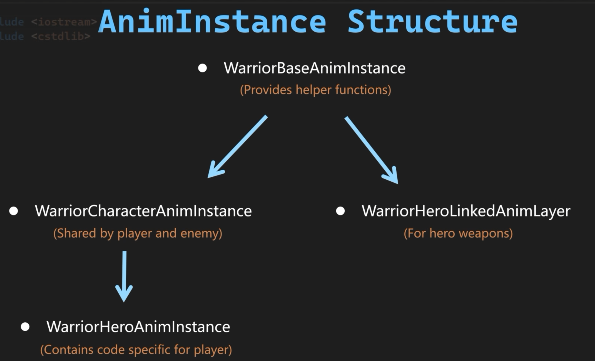
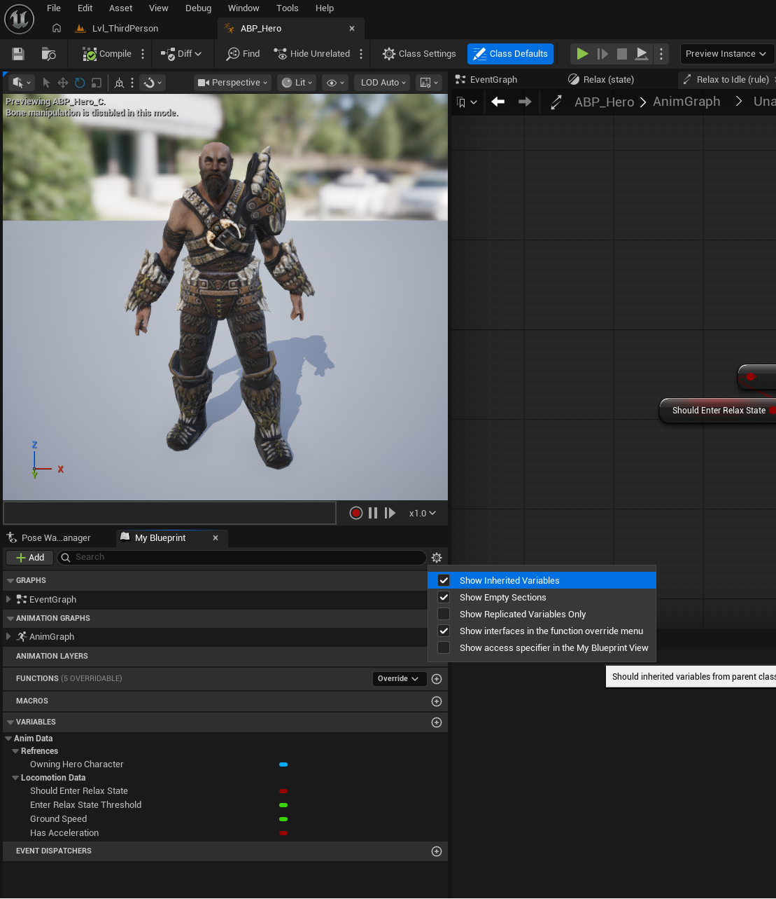
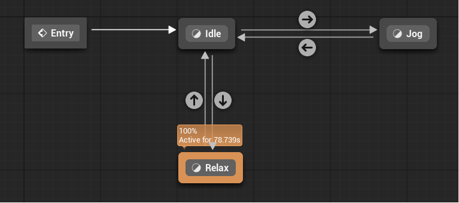
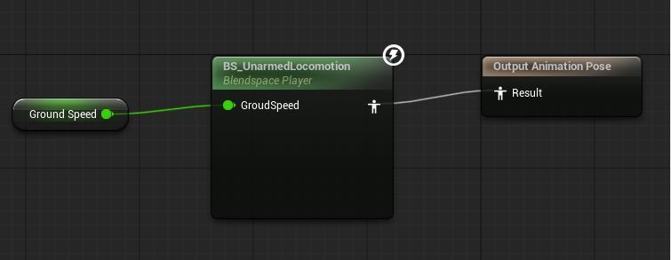

# Locomotion

**Locomotion（移动/运动机制）** 是一个非常核心的技术概念，关注角色在游戏世界中如何从 A 点移动到 B 点，以及在移动过程中如何展现匹配的身体动画。前者由 `CharacterMovementComponent ` 处理，后者由动画蓝图实现。目前我们的角色在移动时只会将方向转向运动的方向，没有更多的动画以及过渡，这一节的目标是添加角色的站立动画`Idle`，走路动画`Jog`，以及当角色站立不动超过一定时间后的 `Relax` 动画。将动画逻辑写在 C++ `AnimInstance` 中可以减少动画蓝图中的节点数量，避免复杂的节点连线，节省 CPU 资源，进行多线程优化（使用 `worker thread`）。

# AnimInstance 动画实例

每一个拥有 `SkeletalMeshComponent` 骨骼模型的角色，在运行时都会分配到一个专属的 `AnimInstance`。角色的状态（比如速度、是否在空中、是否死亡）存在于 `Character` 或 `MovementComponent` 中，`AnimInstance` 每帧从角色身上抓取这些数据，暴露给动画蓝图。动画蓝图状态机中底层的变量判断和状态跳转，全部由 `AnimInstance` 在背后进行计算和驱动。

在 C++ 中编写自定义的 `AnimInstance` 时，有几个最常用的核心重载函数，它们对应着动画实例的生命周期：

- **`NativeInitializeAnimation()`：** 用来做初始化缓存。为了性能，我们通常在这里提前获取并保存角色的指针（`TryGetPawnOwner()`），避免每帧都去调用复杂的获取函数。
- **`NativeUpdateAnimation(float DeltaSeconds)`：** 动画每帧更新的入口。在这里把角色的当前速度、朝向、状态同步到动画实例的变量里。它工作在 `Game Thread`（游戏主线程）上，可以线程安全地读取 Game 线程管辖的 Actor 和组件，一般用来收集数据。
- **`NativeThreadSafeUpdateAnimation(float DeltaSeconds)`：** 它工作在 `Worker Thread` 上。为了不让动画拖垮 `Game` 主线程，利用 CPU 多核优势，UE 提供了一些并行线程。这个函数专门用来对收集到的数据做数学计算与逻辑处理，不能调用 `TryGetPawnOwner()`，不能访问任何外面的 Actor，不能调用非线程安全的蓝图函数，否则容易产生线程冲突。

在 Warrior 项目中先继承 AnimInstance 创建项目专属的 WarriorBaseAnimInstance；继承 WarriorBaseAnimInstance 分别创建 WarriorCharacterAnimInstance，WarriorHeroLinkedAnimLayer；继承 WarriorCharacterAnimInstance 创建 WarriorHeroAnimInstance。

<p align="center">
  
</p>
在 WarriorCharacterAnimInstance 中我们需要缓存角色引用 `OwningCharacter`，获取角色的水平移动速度 `GroundSpeed`，以及水平加速状态 `bHasAcceleration`。如前所述，在 `NativeInitializeAnimation` 中缓存引用，在 `NativeUpdateAnimation` 中收集数据，在 `NativeThreadSafeUpdateAnimation` 中进行计算。`Size2D()` 只计算 X,Y 两个轴上的速度，忽略 Z 轴，`SizeSquared2D()` 同理。


```c++
// WarriorCharacterAnimInstance.h
#pragma once
#include "CoreMinimal.h"
#include "AnimInstances/WarriorBaseAnimInstance.h"
#include "WarriorCharacterAnimInstance.generated.h"

class AWarriorBaseCharacter;
class UCharacterMovementComponent;

UCLASS()
class WARRIOR_API UWarriorCharacterAnimInstance : public UWarriorBaseAnimInstance
{
	GENERATED_BODY()
public:
	virtual void NativeInitializeAnimation() override;
	virtual void NativeUpdateAnimation(float DeltaSeconds) override;
	virtual void NativeThreadSafeUpdateAnimation(float DeltaSeconds) override;

protected:
	UPROPERTY()
	TObjectPtr<AWarriorBaseCharacter> OwningCharacter;

	UPROPERTY()
	TObjectPtr<UCharacterMovementComponent> OwningMovementComponent;

	UPROPERTY(VisibleDefaultsOnly, BlueprintReadOnly, Category = "AnimData|LocomotionData")
	float GroundSpeed;

	UPROPERTY(VisibleDefaultsOnly, BlueprintReadOnly, Category = "AnimData|LocomotionData")
	bool bHasAcceleration;

private:
	FVector CharacterVelocity;
	FVector CharacterAcceleration;
};

// WarriorCharacterAnimInstance.cpp
#include "AnimInstances/WarriorCharacterAnimInstance.h"
#include "Characters/WarriorBaseCharacter.h"
#include "GameFramework/CharacterMovementComponent.h"

void UWarriorCharacterAnimInstance::NativeInitializeAnimation()
{
    OwningCharacter = Cast<AWarriorBaseCharacter>(TryGetPawnOwner());
    if (OwningCharacter)
    {
        OwningMovementComponent = OwningCharacter->GetCharacterMovement();
    }
}

void UWarriorCharacterAnimInstance::NativeUpdateAnimation(float DeltaSeconds)
{
    if (!OwningCharacter || !OwningMovementComponent)
    {
        return;
    }
    CharacterVelocity = OwningCharacter->GetVelocity();
    CharacterAcceleration = OwningMovementComponent->GetCurrentAcceleration();
}

void UWarriorCharacterAnimInstance::NativeThreadSafeUpdateAnimation(float DeltaSeconds)
{
    GroundSpeed = CharacterVelocity.Size2D();
    bHasAcceleration = CharacterAcceleration.SizeSquared2D() > 0.f;
}
```

在 WarriorHeroAnimInstance 中，除了之前得到的变量，我们还需要一个可以在 Editor 中编辑的变量 `EnterRelaxStateThreshold` 设置主角进入 `Relax` 状态的阈值。在重载的 `NativeInitializeAnimation` 中将 AWarriorBaseCharacter 类型的 `Owning Character` 转换为 AWarriorHeroCharacter 类型的 `OwningHeroCharacter `引用。在重载的 `NativeThreadSafeUpdateAnimation` 中累加 `DeltaSeconds` 计时，计算 `bShouldEnterRelaxState` 变量。

```c++
// WarriorHeroAnimInstance.h
#pragma once
#include "CoreMinimal.h"
#include "AnimInstances/WarriorCharacterAnimInstance.h"
#include "WarriorHeroAnimInstance.generated.h"

class AWarriorHeroCharacter;

UCLASS()
class WARRIOR_API UWarriorHeroAnimInstance : public UWarriorCharacterAnimInstance
{
	GENERATED_BODY()
public:
	virtual void NativeInitializeAnimation() override;
	virtual void NativeThreadSafeUpdateAnimation(float DeltaSeconds) override;
protected:
	UPROPERTY(VisibleDefaultsOnly, BlueprintReadOnly, Category = "AnimData|Refrences")
	TObjectPtr<AWarriorHeroCharacter> OwningHeroCharacter;

	UPROPERTY(VisibleDefaultsOnly, BlueprintReadOnly, Category = "AnimData|LocomotionData")
	bool bShouldEnterRelaxState;

	UPROPERTY(EditDefaultsOnly, BlueprintReadOnly, Category = "AnimData|LocomotionData")
	float EnterRelaxStateThreshold = 5.f;

	float IdleElapsedTime;
};

// WarriorHeroAnimInstance.cpp
#include "AnimInstances/Hero/WarriorHeroAnimInstance.h"
#include "Characters/WarriorHeroCharacter.h"

void UWarriorHeroAnimInstance::NativeInitializeAnimation()
{
    Super::NativeInitializeAnimation();
    if (OwningCharacter)
    {
        OwningHeroCharacter = Cast<AWarriorHeroCharacter>(OwningCharacter);
    }
}

void UWarriorHeroAnimInstance::NativeThreadSafeUpdateAnimation(float DeltaSeconds)
{
    Super::NativeThreadSafeUpdateAnimation(DeltaSeconds);
    if (bHasAcceleration)
    {
        IdleElapsedTime = 0.f;
        bShouldEnterRelaxState = false;
    }
    else
    {
        IdleElapsedTime += DeltaSeconds;
        bShouldEnterRelaxState = (IdleElapsedTime >= EnterRelaxStateThreshold);
    }
}
```

# Animation Blueprint 动画蓝图

在 Editor 中创建 Blend Space 1D，以 `GroudSpeed` 为输入参数在 `Idle`，`Jog` 动画之间进行线性插值，设置最小值 0，最大值 400（WarriorHeroCharacter 中设置的最大移速 `MaxWalkSpeed`）。基于 WarriorHeroAnimInstance 创建角色动画蓝图 ABP_Hero，在左下角视窗中勾选 Show Inherited Variables 以显示 C++ 文件中定义的变量。可以看到 VARIABLES 一栏中有使用 Category 分类的 Anim Data。

<p align="center">
  
</p>

添加状态机，命名为 Unarmed Locomotion，在状态机中添加 `Idle`，`Relax`，`Jog` 状态。用 `bShouldEnterRelaxState` 决定进出 `Relax`，用 `bHasAcceleration` 决定进出 `Jog`。因为计算在 C++ 中完成，蓝图只要使用暴露出来的变量，十分简洁。在 Jog 中用 `GroudSpeed` 作为 BS 动画的输入，在 `Relax` 中用 Random Sequence Player 随机播放 `Relax` 动画。

<p align="center">
  
</p>

<p align="center">
  
</p>
