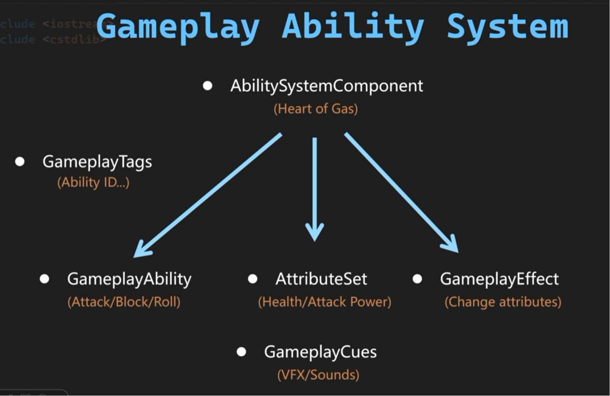
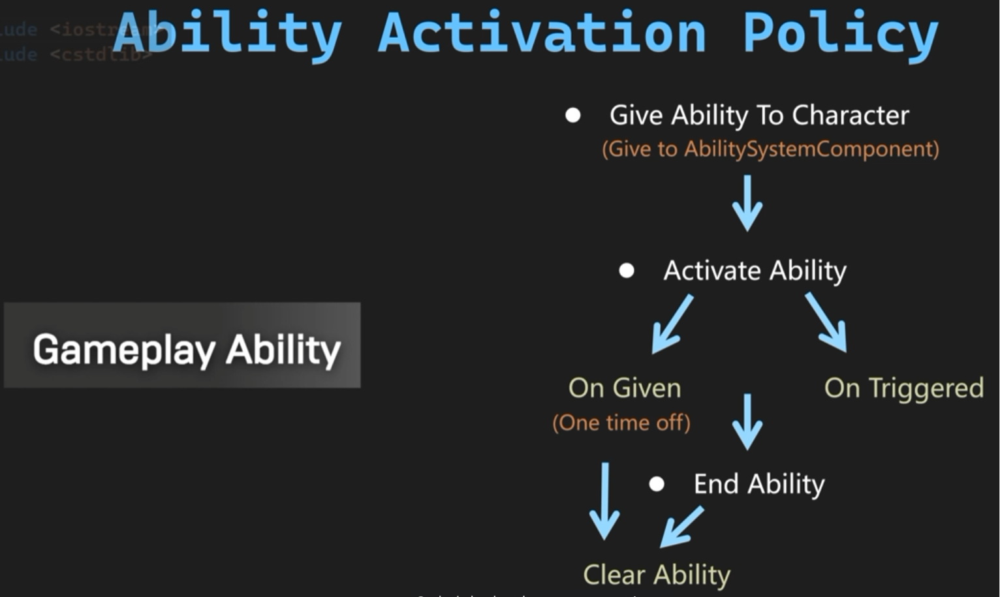
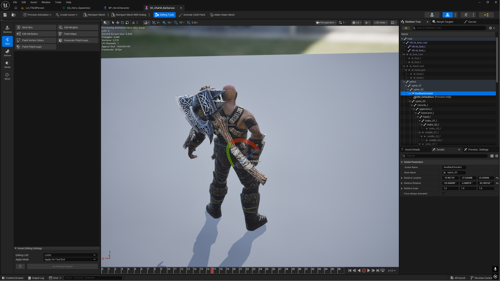
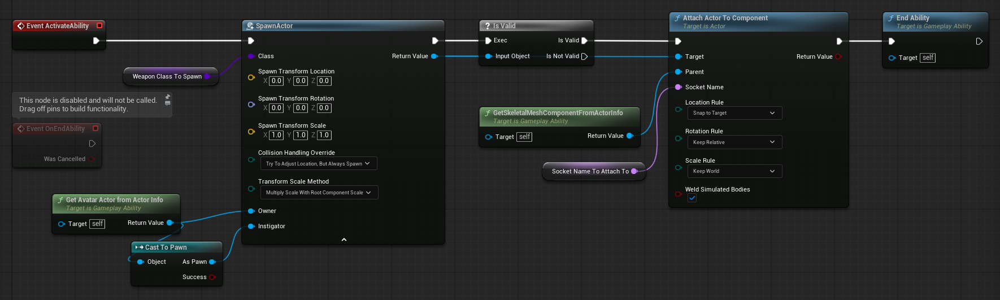
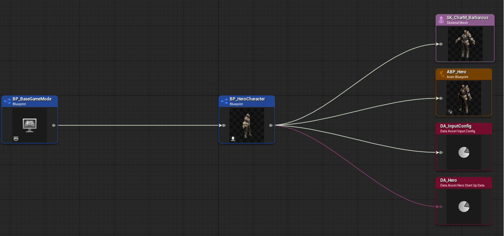

# Gameplay Ability System

在 RPG 游戏中，角色（包括主角、敌人等等）可以拥有特定的能力，比如翻滚、格挡、攻击等，这些能力被 UE 抽象为 GameplayAbility。**Gameplay Ability System（简称 GAS）** 是 UE 官方推出的一套高度模块化、框架极其庞大的**技能与属性系统**。它最初是 Epic 为了开发《堡垒之夜（Fortnite）》和《帕拉贡（Paragon）》而自研的底层架构，后来完全开源给了全体开发者。

**GAS 的优点：**

- **网络联机同步（Replication）**：GAS 内部对高频动作（如释放技能、闪避、吃药、属性扣减）做了一套客户端网络预测机制。客户端释放技能时会立刻响应，而服务器在收到包后会进行验证，如果通过则相安无事，如果不合法则自动将客户端拉回正确状态。不需要自己写网络同步、服务器合法性验证、状态回滚。

- **基于 Gameplay Tags 的状态解耦**：GAS 可以与 Gameplay Tags 结合。每个 Ability 可以配置 `Ability Tags`（Ability ID）， `Cancel Abilities with Tag`（释放时打断别人身上带有什么标签的技能），`Block Abilities with Tag`（释放时禁用别人身上带有什么标签的技能），`Activation Required Tags`（必须拥有此状态才能释放），`Activation Blocked Tags`（有此状态不能释放） 等，使用 Gameplay Tags 的集合运算代替 if-else 状态判定，简化判定代码。

- **数据驱动**：使用 Gameplay Attribute Set 配置属性，Gameplay Effect 修改属性，将数据与逻辑分离。

- **技能释放过程中的异步逻辑控制**：技能往往不是一瞬间完成的，它是一个包含生命周期的过程（例如：前摇 $\rightarrow$ 判定 $\rightarrow$ 伤害触发 $\rightarrow$ 后摇 $\rightarrow$ 结束）。GAS 提供了 Ability Tasks，允许在技能内部安全地进行异步等待和分段控制。

- **统一的表现层**：Gameplay Cue 系统负责 Ability 的音效和粒子特效。服务器只需要同步一个轻量级的 Tag，客户端在本地根据这个 Tag 去查表播放。

  <p align="center">
    
  </p>

下面使用 GAS 在角色初始化时，于角色背后生成一把斧头武器。

# 给角色添加 Ability System Component

`AbilitySystemComponent` 是 GAS 系统的核心，只有拥有此组件的角色才能使用 GAS。 

在编辑器 Edit / Plugins 中搜索并添加 Gameplay Abilities 插件。在 IDE 中找到模块配置文件 Warrior.Build.cs (Warrior 是项目名)，添加  `GameplayTasks` 模块。

```c++
// Games/Warrior/Source/Warrior/Warrior.Build.cs
using UnrealBuildTool;
public class Warrior : ModuleRules
{
	public Warrior(ReadOnlyTargetRules Target) : base(Target)
	{
		PCHUsage = PCHUsageMode.UseExplicitOrSharedPCHs;
         PublicDependencyModuleNames.AddRange(new string[] {
            "Core",
            "CoreUObject",
            "Engine",
            "InputCore",
            "EnhancedInput" ,
            "GameplayTags",
            "GameplayTasks"
        });
		PrivateDependencyModuleNames.AddRange(new string[] {  });
	}
}
```

继承 AbilitySystemComponent 创建 WarriorAbilitySystemComponent；继承 AttributeSet 创建 WarriorAttributeSet。因为无论是主角还是敌人都需要 GAS 系统，我们在 AWarriorBaseCharacter 类中添加 Ability System Component 组件并进行初始化。添加 `WarriorAbilitySystemComponent`，`WarriorAttributeSet` 两个 `UPROPERTY` 组件与相应的 Get 内联函数，在构造函数中创建组件。继承 IAbilitySystemInterface 接口，接口要求必须实现 GetAbilitySystemComponent 函数，函数直接返回 WarriorAbilitySystemComponent。

重载 APawn 的 PossessedBy 函数，当调用 `Controller->Possess(Pawn)` 且占有成功后，引擎会在该 Pawn 上调用 PossessedBy 函数，常在玩家开局或重生时触发，在此适合进行初始化逻辑。调用 `WarriorAbilitySystemComponent->InitAbilityActorInfo(this, this)` 初始化 ActorInfo，`InitAbilityActorInfo(AActor* InOwnerActor, AActor* InAvatarActor)` 有两个输入参数，第一个 `InOwnerActor` 是在逻辑上拥有 WarriorAbilitySystemComponent 组件的 Actor，第二个 `InAvatarActor` 是在世界中 WarriorAbilitySystemComponent 实际产生作用的 Actor，这里两者都是角色，因此使用自引用 this 作为输入。ActorInfo 持有组件拥有者的信息，方便在后续进行判定或引用。

```c++
// WarriorBaseCharacter.h
#pragma once
#include "CoreMinimal.h"
#include "GameFramework/Character.h"
#include "AbilitySystemInterface.h"
#include "WarriorBaseCharacter.generated.h"

class UWarriorAbilitySystemComponent;
class UWarriorAttributeSet;
class UDataAsset_StartUpDataBase;

UCLASS()
class WARRIOR_API AWarriorBaseCharacter : public ACharacter, public IAbilitySystemInterface
{
	GENERATED_BODY()
public:
	AWarriorBaseCharacter();
    
	//~ Begin IAbilitySystemInterface Interface
	virtual UAbilitySystemComponent* GetAbilitySystemComponent() const override;
	//~ End IAbilitySystemInterface Interface
protected:
	//~ Begin APawn Interface.
	virtual void PossessedBy(AController* NewController) override;
	//~ End APawn Interface
    
	UPROPERTY(VisibleAnywhere, BlueprintReadOnly, Category = "AbilitySystem")
	TObjectPtr<UWarriorAbilitySystemComponent> WarriorAbilitySystemComponent;

	UPROPERTY(VisibleAnywhere, BlueprintReadOnly, Category = "AbilitySystem")
	TObjectPtr<UWarriorAttributeSet> WarriorAttributeSet;
public:
	FORCEINLINE UWarriorAbilitySystemComponent* GetWarriorAbilitySystemComponent() const { return WarriorAbilitySystemComponent; }
	FORCEINLINE UWarriorAttributeSet* GetWarriorAttributeSet() const { return WarriorAttributeSet; }
};

// WarriorBaseCharacter.cpp
#include "Characters/WarriorBaseCharacter.h"
#include "AbilitySystem/WarriorAbilitySystemComponent.h"
#include "AbilitySystem/WarriorAttributeSet.h"

AWarriorBaseCharacter::AWarriorBaseCharacter()
{
 	// Set this character to call Tick() every frame.  You can turn this off to improve performance if you don't need it.
	PrimaryActorTick.bCanEverTick = false;
    PrimaryActorTick.bStartWithTickEnabled = false;
    GetMesh()->bReceivesDecals = false;

    WarriorAbilitySystemComponent = CreateDefaultSubobject<UWarriorAbilitySystemComponent>(TEXT("WarriorAbilitySystemComponent"));
    WarriorAttributeSet = CreateDefaultSubobject<UWarriorAttributeSet>(TEXT("WarriorAttributeSet"));
}

UAbilitySystemComponent* AWarriorBaseCharacter::GetAbilitySystemComponent() const
{
    return GetWarriorAbilitySystemComponent();
}

void AWarriorBaseCharacter::PossessedBy(AController* NewController)
{
    Super::PossessedBy(NewController);
    if (WarriorAbilitySystemComponent)
    {
        WarriorAbilitySystemComponent->InitAbilityActorInfo(this, this);
    }
}
```

# 创建 Gameplay Ability

<p align="center">
  
</p>

当给角色添加 Ability 时，实际上是角色拥有的 AbilitySystemComponent 组件持有这个 Ability。Ability 的触发有两种模式 `On Given`，`On Triggered`。`On Given` 当角色拥有 Ability 时一次性触发，在角色失去 Ability 时移除；`On Triggered` 则可以根据输入或事件反复触发。

继承 GameplayAbility 创建 WarriorGameplayAbility，使用一个枚举类 `EWarriorAbilityActivationPolicy` 囊括 `On Given`，`On Triggered` 两种 policy。WarriorGameplayAbility 拥有此类型的枚举属性 `AbilityActivationPolicy`，暴露给编辑器方便配置。重载 `OnGiveAbility`，`EndAbility` 两个函数，分别在 Ability 被授予和结束时调用。如果是 `OnGiven` 属性，在 `OnGiveAbility` 函数中检查 `Spec` 判断 Ability 是否被激活，没有则调用 `ActorInfo->AbilitySystemComponent->TryActivateAbility(Spec.Handle)` 激活。在 `EndAbility` 函数中调用 `ActorInfo->AbilitySystemComponent->ClearAbility(Handle)` 移除 Ability。

```c++
// WarriorGameplayAbility.h
#pragma once
#include "CoreMinimal.h"
#include "Abilities/GameplayAbility.h"
#include "WarriorGameplayAbility.generated.h"

UENUM(BlueprintType)
enum class EWarriorAbilityActivationPolicy : uint8
{
	OnTriggered,
	OnGiven
};

UCLASS()
class WARRIOR_API UWarriorGameplayAbility : public UGameplayAbility
{
	GENERATED_BODY()
protected:
	//~ Begin UGameplayAbility Interface
	virtual void OnGiveAbility(const FGameplayAbilityActorInfo* ActorInfo, const FGameplayAbilitySpec& Spec) override;
	virtual void EndAbility(const FGameplayAbilitySpecHandle Handle, const FGameplayAbilityActorInfo* ActorInfo, const FGameplayAbilityActivationInfo ActivationInfo, bool bReplicateEndAbility, bool bWasCancelled) override;
	//~ End UGameplayAbility Interface

	UPROPERTY(EditDefaultsOnly, Category = "WarriorAbility")
	EWarriorAbilityActivationPolicy AbilityActivationPolicy = EWarriorAbilityActivationPolicy::OnTriggered;
};

// WarriorGameplayAbility.cpp
#include "AbilitySystem/Abilities/WarriorGameplayAbility.h"
#include "AbilitySystem/WarriorAbilitySystemComponent.h"

void UWarriorGameplayAbility::OnGiveAbility(const FGameplayAbilityActorInfo* ActorInfo, const FGameplayAbilitySpec& Spec)
{
    Super::OnGiveAbility(ActorInfo, Spec);
    if (AbilityActivationPolicy == EWarriorAbilityActivationPolicy::OnGiven)
    {
        if (ActorInfo && !Spec.IsActive())
        {
            ActorInfo->AbilitySystemComponent->TryActivateAbility(Spec.Handle);
        }
    }
}

void UWarriorGameplayAbility::EndAbility(const FGameplayAbilitySpecHandle Handle, const FGameplayAbilityActorInfo* ActorInfo, const FGameplayAbilityActivationInfo ActivationInfo, bool bReplicateEndAbility, bool bWasCancelled)
{
    Super::EndAbility(Handle, ActorInfo, ActivationInfo, bReplicateEndAbility, bWasCancelled);
    if (AbilityActivationPolicy == EWarriorAbilityActivationPolicy::OnGiven)
    {
        if (ActorInfo)
        {
            ActorInfo->AbilitySystemComponent->ClearAbility(Handle);
        }
    }
}
```

`OnGiveAbility(const FGameplayAbilityActorInfo* ActorInfo, const FGameplayAbilitySpec& Spec)` 第一个输入参数 `ActorInfo` 的类型是一个 `FGameplayAbilityActorInfo` 结构体，该结构体缓存使用 Ability 的 Actor 相关数据，包括 `OwnerActor`，`AvatarActor`，`PlayerController`，`AbilitySystemComponent`，`SkeletalMeshComponent`，`AnimInstance`，`MovementComponent` 等，以确定 Ability 作用于哪个 Actor。使用指针传递引用以支持多态。前面在 WarriorBaseCharacter 中重载的 `PossessedBy` 函数中调用了 `InitAbilityActorInfo`，`InitAbilityActorInfo` 会调用 `InitFromActor` 初始化 `ActorInfo`。

```c++
/**
 *	FGameplayAbilityActorInfo
 *
 *	Cached data associated with an Actor using an Ability.
 *		-Initialized from an AActor* in InitFromActor
 *		-Abilities use this to know what to actor upon. E.g., instead of being coupled to a specific actor class.
 *		-These are generally passed around as pointers to support polymorphism.
 *		-Projects can override UAbilitySystemGlobals::AllocAbilityActorInfo to override the default struct type that is created.
 */
USTRUCT(BlueprintType)
struct FGameplayAbilityActorInfo
{
	GENERATED_USTRUCT_BODY()

	virtual ~FGameplayAbilityActorInfo() {}

	/** The actor that owns the abilities, shouldn't be null */
	UPROPERTY(BlueprintReadOnly, Category = "ActorInfo")
	TWeakObjectPtr<AActor>	OwnerActor;

	/** The physical representation of the owner, used for targeting and animation. This will often be null! */
	UPROPERTY(BlueprintReadOnly, Category = "ActorInfo")
	TWeakObjectPtr<AActor>	AvatarActor;

	/** PlayerController associated with the owning actor. This will often be null! */
	UPROPERTY(BlueprintReadOnly, Category = "ActorInfo")
	TWeakObjectPtr<APlayerController>	PlayerController;

	/** Ability System component associated with the owner actor, shouldn't be null */
	UPROPERTY(BlueprintReadOnly, Category = "ActorInfo")
	TWeakObjectPtr<UAbilitySystemComponent>	AbilitySystemComponent;

	/** Skeletal mesh of the avatar actor. Often null */
	UPROPERTY(BlueprintReadOnly, Category = "ActorInfo")
	TWeakObjectPtr<USkeletalMeshComponent>	SkeletalMeshComponent;

 	/** Anim instance of the avatar actor. Often null */
	UPROPERTY(BlueprintReadOnly, Category = "ActorInfo")
	TWeakObjectPtr<UAnimInstance>	AnimInstance;

	/** Movement component of the avatar actor. Often null */
	UPROPERTY(BlueprintReadOnly, Category = "ActorInfo")
	TWeakObjectPtr<UMovementComponent>	MovementComponent;
	
	/** The linked Anim Instance that this component will play montages in. Use NAME_None for the main anim instance. */
	UPROPERTY(BlueprintReadOnly, Category = "ActorInfo")
	FName AffectedAnimInstanceTag; 
    
    // ......
};
```

第二个参数 `Spec` 类型是 `FGameplayAbilitySpec`，存储 Ability 的信息以及当前的状态。

```c++
/**
 * An activatable ability spec, hosted on the ability system component. This defines both what the ability is (what class, what level, input binding etc)
 * and also holds runtime state that must be kept outside of the ability being instanced/activated.
 */
USTRUCT(BlueprintType)
struct FGameplayAbilitySpec : public FFastArraySerializerItem
{
	// ......
	/** Handle for outside sources to refer to this spec by */
	UPROPERTY()
	FGameplayAbilitySpecHandle Handle;
	
	/** Ability of the spec (Always the CDO. This should be const but too many things modify it currently) */
	UPROPERTY()
	TObjectPtr<UGameplayAbility> Ability;
	
	/** Level of Ability */
	UPROPERTY()
	int32	Level;

	/** InputID, if bound */
	UPROPERTY()
	int32	InputID;

	/** Object this ability was created from, can be an actor or static object. Useful to bind an ability to a gameplay object */
	UPROPERTY()
	TWeakObjectPtr<UObject> SourceObject;
    
    // ......
};
```

在编辑器中以 WarriorGameplayAbility 为父类创建一个 Gameplay Ability Blueprint，命名为 GA_Shared_SpawnWeapon，shared 表示主角和敌人都会使用这个 Ability。打开蓝图将 `AbilityActivationPolicy` 属性配置为 `OnGiven`。

# Weapon Class

要让 Ability 生成武器，还需要一个武器类。继承 Actor 创建 WarriorWeaponBase；继承 WarriorWeaponBase 创建 WarriorHeroWeapon。武器类需要 `UStaticMeshComponent` 网格组件以及 `UBoxComponent` 碰撞体组件。在构造函数中进行初始化。

```c++
// WarriorWeaponBase.h
#pragma once
#include "CoreMinimal.h"
#include "GameFramework/Actor.h"
#include "WarriorWeaponBase.generated.h"

class UBoxComponent;

UCLASS()
class WARRIOR_API AWarriorWeaponBase : public AActor
{
	GENERATED_BODY()
public:	
	AWarriorWeaponBase();
protected:
	UPROPERTY(VisibleAnywhere, BlueprintReadOnly, Category = "Weapons")
	TObjectPtr<UStaticMeshComponent> WeaponMesh;

	UPROPERTY(VisibleAnywhere, BlueprintReadOnly, Category = "Weapons")
	TObjectPtr<UBoxComponent> WeaponCollisionBox;
public:
	FORCEINLINE UBoxComponent* GetWeaponCollisionBox() const { return WeaponCollisionBox; }
};

// WarriorWeaponBase.cpp
#include "Items/Weapons/WarriorWeaponBase.h"
#include "Components/BoxComponent.h"

AWarriorWeaponBase::AWarriorWeaponBase()
{
 	// Set this actor to call Tick() every frame.  You can turn this off to improve performance if you don't need it.
	PrimaryActorTick.bCanEverTick = false;

    WeaponMesh = CreateDefaultSubobject<UStaticMeshComponent>(TEXT("WeaponMesh"));
    SetRootComponent(WeaponMesh);

    WeaponCollisionBox = CreateDefaultSubobject<UBoxComponent>(TEXT("WeaponCollisionBox"));
    WeaponCollisionBox->SetupAttachment(GetRootComponent());
    WeaponCollisionBox->SetBoxExtent(FVector(20.f));
    WeaponCollisionBox->SetCollisionEnabled(ECollisionEnabled::NoCollision);
}
```

基于 WarriorHeroWeapon 创建蓝图 BP_HeroWeaponBase，基于 BP_HeroWeaponBase 创建武器蓝图 BP_HeroAxe，配置斧子网格模型，调整碰撞盒。

打开角色骨骼模型，在斧子生成的位置创建插槽 `AxeBackSocket`，添加 Preview Asset 预览效果方便调整插槽位置。

<p align="center">
  
</p>

# 在 Gameplay Ability 中完成 Spawn 逻辑

目前我们已经有了要生成的武器类，武器生成的插槽，下面可以在 GA_Shared_SpawnWeapon 蓝图中写生成逻辑。在 ActivateAbility Event 中使用 SpawnActor 节点，拉出要生成的 Class 提升为 `Weapon Class to Spawn` 变量，设置变量类型为 WarriorWeaponBase 类引用。通过 Get Avatar Actor from Actor Info 节点获取 Ability 在世界中作用的 Actor 作为 Owner 引脚的输入，并用 pure cast 转化成 Pawn 类型作为 Instigator 引脚的输入。生成之后用 Attach Actor to Component，将武器拉到插槽位置，`Get Skeletal Mesh Component from Actor Info` 从 Actor Info 中获取拥有者的骨骼模型，连接 Parent 引脚。在之前 Actor Info 的源码中可以看到这些持有的引用。最后调用 End Ability，因为生成武器是个一次性触发的能力，之前设置为 `OnGiven`，生成之后直接 End 即可。Spawn 暴露了两个变量，`Weapon Class to Spawn` 生成什么类型的武器，`Socket Name to Attach to`  插入到哪个插槽里。
<p align="center">
  
</p>

这个 Spawn 逻辑是通用的。完成后基于 GA_Shared_SpawnWeapon 创建  GA_HeroSpawnAxe，配置 `Weapon Class to Spawn` 为之前创建的武器蓝图 BP_HeroAxe，生成插槽为 `AxeBackSocket`。

# 用 DataAsset 分离数据、逻辑 

我们还需要一个 DataAsset 来配置 Abilities。继承 DataAsset 创建 DataAsset_StartUpDataBase；继承 DataAsset_StartUpDataBase 创建 DataAsset_HeroStartUpData。持有两个 `UWarriorGameplayAbility` 类型的列表 `ActivateOnGivenAbilities`，`ReactiveAbilities`。前者是 `OnGiven` 类型的 Abilities，后者是 `OnTriggered` 类型的 Abilities。提供 `GiveToAbilitySystemComponent(UWarriorAbilitySystemComponent* InWarriorASCToGive, int32 ApplyLevel = 1)` 函数将 Activities 发给输入的 `AbilitySystemComponent`。`ApplyLevel` 参数表示难度等级之类。

``` c++
// DataAsset_StartUpDataBase.h
#pragma once
#include "CoreMinimal.h"
#include "Engine/DataAsset.h"
#include "DataAsset_StartUpDataBase.generated.h"

class UWarriorGameplayAbility;
class UWarriorAbilitySystemComponent;

UCLASS()
class WARRIOR_API UDataAsset_StartUpDataBase : public UDataAsset
{
	GENERATED_BODY()
public:
	virtual void GiveToAbilitySystemComponent(UWarriorAbilitySystemComponent* InWarriorASCToGive, int32 ApplyLevel = 1);
protected:
	UPROPERTY(EditAnywhere, Category = "StartUpData")
	TArray<TSubclassOf<UWarriorGameplayAbility>> ActivateOnGivenAbilities;

	UPROPERTY(EditAnywhere, Category = "StartUpData")
	TArray<TSubclassOf<UWarriorGameplayAbility>> ReactiveAbilities;

	void GrantAbilities(const TArray<TSubclassOf<UWarriorGameplayAbility>>& InAbilitiesToGive, UWarriorAbilitySystemComponent* InWarriorASCToGive, int32 ApplyLevel = 1);
};

// DataAsset_StartUpDataBase.cpp
#include "DataAssets/StartUpData/DataAsset_StartUpDataBase.h"
#include "AbilitySystem/WarriorAbilitySystemComponent.h"
#include "AbilitySystem/Abilities/WarriorGameplayAbility.h"

void UDataAsset_StartUpDataBase::GiveToAbilitySystemComponent(UWarriorAbilitySystemComponent* InASCToGive, int32 ApplyLevel)
{
    check(InASCToGive);
    GrantAbilities(ActivateOnGivenAbilities, InASCToGive, ApplyLevel);
    GrantAbilities(ReactiveAbilities, InASCToGive, ApplyLevel);
}

void UDataAsset_StartUpDataBase::GrantAbilities(const TArray<TSubclassOf<UWarriorGameplayAbility>>& InAbilitiesToGive, UWarriorAbilitySystemComponent* InASCToGive, int32 ApplyLevel)
{
    if (InAbilitiesToGive.IsEmpty())
    {
        return;
    }
    for (const TSubclassOf<UWarriorGameplayAbility>& Ability : InAbilitiesToGive)
    {
        if (!Ability) continue;
        FGameplayAbilitySpec AbilitySpec(Ability);
        AbilitySpec.SourceObject = InASCToGive->GetAvatarActor();
        AbilitySpec.Level = ApplyLevel;
        InASCToGive->GiveAbility(AbilitySpec);
    }
}
```

在编辑器中基于 DataAsset_HeroStartUpData 创建数据文件 DA_Hero，将 GA_Hero_SpawnAxe 加入 `ActivateOnGivenAbilities` 列表。在 WarriorBaseCharacter.h 中使用软引用 `TSoftObjectPtr` 引用 `CharacterStartUpData`。在 `PossessedBy` 函数中检查 `CharacterStartUpData` 是否已配置。

```c++
// WarriorBaseCharacter.h
// ......
UCLASS()
class WARRIOR_API AWarriorBaseCharacter : public ACharacter, public IAbilitySystemInterface
{
protected:
	// ......
	UPROPERTY(VisibleAnywhere, BlueprintReadOnly, Category = "AbilitySystem")
	TObjectPtr<UWarriorAbilitySystemComponent> WarriorAbilitySystemComponent;

	UPROPERTY(VisibleAnywhere, BlueprintReadOnly, Category = "AbilitySystem")
	TObjectPtr<UWarriorAttributeSet> WarriorAttributeSet;

	UPROPERTY(EditDefaultsOnly, BlueprintReadOnly, Category = "CharacterData")
	TSoftObjectPtr<UDataAsset_StartUpDataBase> CharacterStartUpData;
    // ......
};

// WarriorBaseCharacter.cpp
// ......
void AWarriorBaseCharacter::PossessedBy(AController* NewController)
{
    Super::PossessedBy(NewController);
    if (WarriorAbilitySystemComponent)
    {
        WarriorAbilitySystemComponent->InitAbilityActorInfo(this, this);
        ensureMsgf(!CharacterStartUpData.IsNull(), TEXT("Forget to assign start up data to %s"), *GetName());
    }
}
```

在 WarriorHeroCharacter 的 `PossessedBy` 函数中用 `IsNull()` 再次检查 `CharacterStartUpData`。软引用的 `IsValid()` 函数用来测试指针是否指向一个已生成的 `live UObject`，如果指针有赋值但是资源没加载也会返回 `false`。因此这里使用 `IsNull()` 判断指针 `CharacterStartUpData` 是否为空。然后使用同步加载 `LoadSynchronous` 手动加载 `LoadedData`，调用 `GiveToAbilitySystemComponent` 将数据文件 DA_Hero 中配置的 Abilities 全部交给主角持有的 `WarriorAbilitySystemComponent`。我们写的 GA_HeroSpawnAxe 是 `OnGiven` Activity，因此在被赋予的时候激活，生成武器，然后被清除。

```c++
// WarriorHeroCharacter.cpp
void AWarriorHeroCharacter::PossessedBy(AController* NewController)
{
    Super::PossessedBy(NewController);
    if (!CharacterStartUpData.IsNull())
    {
        if (UDataAsset_StartUpDataBase* LoadedData = CharacterStartUpData.LoadSynchronous())
        {
            LoadedData->GiveToAbilitySystemComponent(WarriorAbilitySystemComponent);
        }
    }
}
```

软指针在加载前只保存了路径，加载之后才能作为引用使用。同步加载在主线程 game thread 中完成，优点是可以直接获得加载资源的返回值，缺点是可能阻塞主线程造成卡顿。异步加载在后台线程完成，不会阻塞主线程。这里我们需要使用 `LoadedData` 因此直接使用同步加载。

在角色蓝图 BP_HeroCharacter 中找到暴露的 `Character Start Up Data` 属性，配置为 DA_Hero 数据文件。因为 DA_Hero 使用软引用，在角色蓝图的 sizemap 中看不到该文件。使用 reference viewer 可以查看蓝图的所有引用，软引用使用紫线连接，而硬引用使用白线连接。

<p align="center">
  
</p>

至此全部完成，运行可以看到角色在初始化时在背后生成了武器。我们使用 GAS 系统，让角色持有 AbilitySystemComponent 组件，将生成武器抽象为一种 `OnGiven` 类型的 Ability，把生成逻辑写在 GA_Hero_SpawnAxe 里。使用数据文件 DA_Hero 管理角色在初始化时拥有的 Ability，最后角色只要用软引用持有这个数据文件即可，实现了数据和逻辑的解耦。

