# 需求

完成武器生成后，这节开发登记武器，装备、卸下武器的功能。当玩家按下按键 “1” 时，将武器从背后拔出，装备武器；再按下 “1” 时，收起武器到背后，无论是装备还是卸下，执行过程中都不能被再次装卸的输入打断。当角色处于空手、持械不同状态时，Locomotion 会播放不同的移动动画。

这个功能涉及到 GAS、输入绑定、动画。首先我们需要自定义一个 `CombatComponent` 组件挂载到角色上，负责登记武器、战斗相关逻辑，当武器生成时，需要登记到这个组件中以便引用；然后将装备、卸下武器抽象成两个 `OnTriggered` 类型的 HeroGameplayAbility，并在触发时完成武器切换插槽、播放 Montage 动画、切换 LinkedAnimLayer、增加新的 IMC、绑定输入等逻辑。给 Ability 配置 Gameplay Tag 来实现阻断，当正在拿起装备时不能再次触发这两个 Ability，防止冲突。

整体系统对于任何武器、动画都能解耦，删改不需要修改动画蓝图中的节点。

# 登记武器

## Pawn Combat Component

ActorComponent 是可挂载到 Actor 上，不带世界坐标的组件基类，适合纯逻辑 / 数据 / 系统，不需要在场景里有位置、朝向、缩放。PawnCombatComponent 继承此基类，通过组合将装备、战斗逻辑从 Charactrer 类中拆分出来，体现了组合优于继承的原则。

先继承 ActorComponent 创建 PawnExtensionComponentBase，然后继承 PawnExtensionComponentBase 创建 PawnCombatComponent。之后再基于 PawnCombatComponent 创建属于 Hero 或 Enemy 的组件。PawnExtensionComponentBase 中只有 helper function，不写具体逻辑。

  <p align="center">
    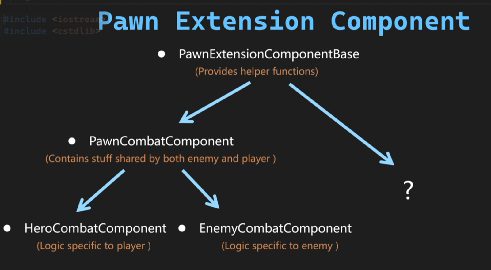
  </p>

`GetOwningPawn`，`GetOwningController` 两个函数用模板在调用时指定返回类型，`TPointerIsConvertibleFromTo<T, APawn>::Value` 是编译期类型检查，检查 T 是否是 Pawn 的子类。`CastChecked<T>(GetOwner())` 是运行时类型检查，确保组件挂载的 Actor 能够当成调用时指定的 T 类型使用。

```C++
// Components/PawnExtensionComponentBase.h
#pragma once
#include "CoreMinimal.h"
#include "Components/ActorComponent.h"
#include "PawnExtensionComponentBase.generated.h"

UCLASS( ClassGroup=(Custom), meta=(BlueprintSpawnableComponent) )
class WARRIOR_API UPawnExtensionComponentBase : public UActorComponent
{
	GENERATED_BODY()
protected:
	template<class T>
	T* GetOwningPawn() const
	{
		static_assert(TPointerIsConvertibleFromTo<T, APawn>::Value, "'T' Template Parameter get GetPawn must be derived from APawn");
		return CastChecked<T>(GetOwner());
	}

	APawn* GetOwningPawn() const
	{
		return GetOwningPawn<APawn>();
	}

	template<class T>
	T* GetOwningController() const
	{
		static_assert(TPointerIsConvertibleFromTo<T, AController>::Value, "'T' Template Parameter to GetController must be derived from Acontroller");
		return GetOwningPawn<APawn>()->GetController<T>();
	}
};
```

在 PawnCombatComponent 中使用 GameplayTag 关联武器进行管理。`TMap<FGameplayTag, AWarriorWeaponBase*> CharacterCarriedWeaponMap` 用 Hash Map 保存了 GameplayTag 到武器引用的映射。`RegisterSpawnedWeapon` 函数登记武器，`GetCharacterCarriedWeaponByTag` 根据输入 Tag 返回武器引用。`CurrentEquippedWeaponTag` 是当前装备的武器对应的 Tag，`GetCharacterCurrentEquippedWeapon` 返回当前装备武器的引用。

```C++
// Components/Combat/PawnCombatComponent.h
#pragma once
#include "CoreMinimal.h"
#include "Components/PawnExtensionComponentBase.h"
#include "GameplayTagContainer.h"
#include "PawnCombatComponent.generated.h"

class AWarriorWeaponBase;

UCLASS()
class WARRIOR_API UPawnCombatComponent : public UPawnExtensionComponentBase
{
	GENERATED_BODY()
public:
	UFUNCTION(BlueprintCallable, Category = "Warrior|Combat")
	void RegisterSpawnedWeapon(FGameplayTag InWeaponTagToRegister, AWarriorWeaponBase* InWeaponToRegister, bool bRegisterAsEquippedWeapon = false);

	UFUNCTION(BlueprintCallable, Category = "Warrior|Combat")
	AWarriorWeaponBase* GetCharacterCarriedWeaponByTag(FGameplayTag InWeaponTagToGet) const;

	UPROPERTY(BlueprintReadWrite, Category = "Warrior|Combat")
	FGameplayTag CurrentEquippedWeaponTag;

	UFUNCTION(BlueprintCallable, Category = "Warrior|Combat")
	AWarriorWeaponBase* GetCharacterCurrentEquippedWeapon() const;

private:
	TMap<FGameplayTag, AWarriorWeaponBase*> CharacterCarriedWeaponMap;
};

// PawnCombatComponent.cpp
#include "Components/Combat/PawnCombatComponent.h"
#include "Items/Weapons/WarriorWeaponBase.h"

void UPawnCombatComponent::RegisterSpawnedWeapon(FGameplayTag InWeaponTagToRegister, AWarriorWeaponBase* InWeaponToRegister, bool bRegisterAsEquippedWeapon)
{
    checkf(!CharacterCarriedWeaponMap.Contains(InWeaponTagToRegister), TEXT("Weapon %s has already been added as carried weapon"), *InWeaponTagToRegister.ToString());
    check(InWeaponToRegister);

    CharacterCarriedWeaponMap.Emplace(InWeaponTagToRegister, InWeaponToRegister);

    if (bRegisterAsEquippedWeapon)
    {
        CurrentEquippedWeaponTag = InWeaponTagToRegister;
    }

    UE_LOG(LogTemp, Log, TEXT("A weapon named: %s has been registered using the tag %s"), *InWeaponToRegister->GetName(), *InWeaponTagToRegister.ToString());
}

AWarriorWeaponBase* UPawnCombatComponent::GetCharacterCarriedWeaponByTag(FGameplayTag InWeaponTagToGet) const
{
    if (CharacterCarriedWeaponMap.Contains(InWeaponTagToGet))
    {
        if (AWarriorWeaponBase* const* FoundWeapon = CharacterCarriedWeaponMap.Find(InWeaponTagToGet))
        {
            return *FoundWeapon;
        }
    }
    return nullptr;
}

AWarriorWeaponBase* UPawnCombatComponent::GetCharacterCurrentEquippedWeapon() const
{
    if (!CurrentEquippedWeaponTag.IsValid())
    {
        return nullptr;
    }
    return GetCharacterCarriedWeaponByTag(CurrentEquippedWeaponTag);
}
```

继承 PawnCombatComponent 创建 HeroCombatComponent。增加 `GetHeroCarriedWeaponByTag` 调用 `GetCharacterCarriedWeaponByTag` 转化成 `AWarriorHeroWeapon` 类型返回。

```C++
// Components/Combat/HeroCombatComponent.h
#pragma once
#include "CoreMinimal.h"
#include "Components/Combat/PawnCombatComponent.h"
#include "HeroCombatComponent.generated.h"

class AWarriorHeroWeapon;

UCLASS()
class WARRIOR_API UHeroCombatComponent : public UPawnCombatComponent
{
	GENERATED_BODY()
public:
	UFUNCTION(BlueprintCallable, Category = "Warrior|Combat")
	AWarriorHeroWeapon* GetHeroCarriedWeaponByTag(FGameplayTag InWeaponTag) const;
};

// HeroCombatComponent.cpp
#include "Components/Combat/HeroCombatComponent.h"
#include "Items/Weapons/WarriorHeroWeapon.h"

AWarriorHeroWeapon* UHeroCombatComponent::GetHeroCarriedWeaponByTag(FGameplayTag InWeaponTag) const
{
    return Cast<AWarriorHeroWeapon>(GetCharacterCarriedWeaponByTag(InWeaponTag));
}
```

写好组件后，在 WarriorHeroCharacter 中以组合的方式持有该组件。

```C++
// Characters/WarriorHeroCharacter.h
UCLASS()
class WARRIOR_API AWarriorHeroCharacter : public AWarriorBaseCharacter
{
// ......
private:
#pragma region Components
    // ......
	UPROPERTY(VisibleAnywhere, BlueprintReadOnly, Category = "Combat", meta = (AllowPrivateAccess = "true"))
	TObjectPtr<UHeroCombatComponent> HeroCombatComponent;
#pragma endregion
// ......
public:
	FORCEINLINE UHeroCombatComponent* GetHeroCombatComponent() const { return HeroCombatComponent; }
};

// WarriorHeroCharacter.cpp
AWarriorHeroCharacter::AWarriorHeroCharacter()
{
    // ......
    HeroCombatComponent = CreateDefaultSubobject<UHeroCombatComponent>(TEXT("HeroCombatComponent"));
}
```

## Get PawnCombatComponent From Actor Info

GA 蓝图中通过 ActorInfo 结构体引用 Actor 的各个组件，但是 CombatComponent 不在其中，因此在 WarriorGameplayAbility 中增加一个获取 PawnCombatComponent 组建的函数方便在 GA 蓝图中调用。

```C++
// AbilitySystem/Abilities/WarriorGameplayAbility.h
class UPawnCombatComponent;

UCLASS()
class WARRIOR_API UWarriorGameplayAbility : public UGameplayAbility
{
	GENERATED_BODY()
protected:
    // ......
	UFUNCTION(BlueprintPure, Category = "Warrior|Ability")
	UPawnCombatComponent* GetPawnCombatComponentFromActorInfo() const;
};

// WarriorGameplayAbility.cpp
#include "Components/Combat/PawnCombatComponent.h"
UPawnCombatComponent* UWarriorGameplayAbility::GetPawnCombatComponentFromActorInfo() const
{
    return GetAvatarActorFromActorInfo()->FindComponentByClass<UPawnCombatComponent>();
}   
```

给武器定义 GameplayTag: Player.Weapon.Axe。

```C++
// WarriorGameplayTags.h
namespace WarriorGameplayTags 
{
    // ......
    /** Player Tags **/
    WARRIOR_API UE_DECLARE_GAMEPLAY_TAG_EXTERN(Player_Weapon_Axe);
}

// WarriorGameplayTags.cpp
namespace WarriorGameplayTags
{
    // ......
    /** Player Tags **/
    UE_DEFINE_GAMEPLAY_TAG(Player_Weapon_Axe, "Player.Weapon.Axe");
}
```

  <p align="center">
    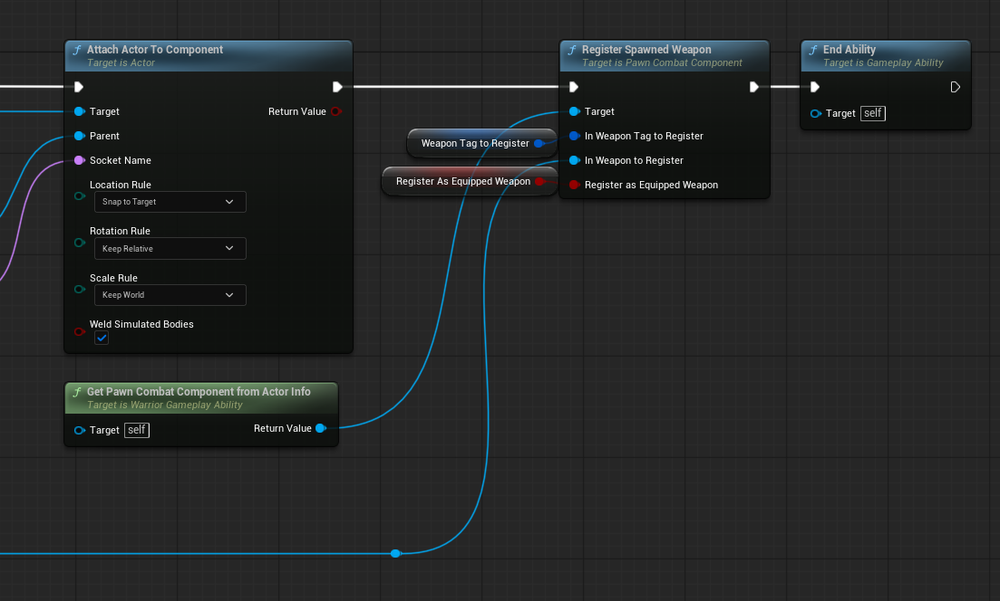
  </p>

在 GA_Shared_SpawnWeapon 蓝图中，生成武器并绑到后背插槽后，通过 `GetPawnCombatComponentFromActorInfo` 引用 `RegisterSpawnedWeapon` 函数完成登记。`Weapon` 引脚连接之前生成的武器，`Tag` 和 `Register As Equipped Weapon` 提升为变量暴露，方便配置。在 Hero Character 使用的 GA_Hero_SpawnAxe 中配置属性。

  <p align="center">
    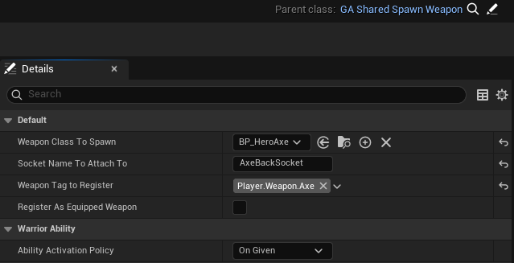
  </p>


# Hero Gameplay Ability Settings

之前武器生成的 GA 是所有角色通用的，现在需要一个玩家角色使用的 GA 类，继承 WarriorGameplayAbility 创建 WarriorHeroGameplayAbility。ActorInfo 中使用 `TWeakObjectPtr` 指针引用相关组件，它只是指向引用，并不保证引用对象处于 alive 状态，不增加引用计数。扩展的 WarriorHeroGameplayAbility 同样使用弱指针引用玩家角色 `WarriorHeroCharacter` 和对应的 `WarriorHeroController`，提供相应的 Get 函数。使用弱指针前先用 `IsValid()` 函数判断对象可用状态，如果不可用则从 `CurrentActorInfo` 获取对应组件（`AvatarActor`, `playerController`）并转换。此外还提供了一个 `HeroCombatComponent` 组件 Get 函数，方便之后在 GA 蓝图写武器装备、卸下逻辑时使用。

```C++
// AbilitySystem/Abilities/WarriorHeroGameplayAbility.h
#pragma once
#include "CoreMinimal.h"
#include "AbilitySystem/Abilities/WarriorGameplayAbility.h"
#include "WarriorHeroGameplayAbility.generated.h"

class AWarriorHeroCharacter;
class AWarriorHeroController;
class UHeroCombatComponent;

UCLASS()
class WARRIOR_API UWarriorHeroGameplayAbility : public UWarriorGameplayAbility
{
	GENERATED_BODY()
public:
	UFUNCTION(BlueprintPure, Category = "Warrior|Ability")
	AWarriorHeroCharacter* GetHeroCharacterFromActorInfo();

	UFUNCTION(BlueprintPure, Category = "Warrior|Ability")
	AWarriorHeroController* GetHeroControllerFromActorInfo();

	UFUNCTION(BlueprintPure, Category = "Warrior|Ability")
	UHeroCombatComponent* GetHeroCombatComponentFromActorInfo();

private:
	TWeakObjectPtr<AWarriorHeroCharacter> CachedWarriorHeroCharacter;
	TWeakObjectPtr<AWarriorHeroController> CachedWarriorHeroController;
};

// WarriorHeroGameplayAbility.cpp
#include "AbilitySystem/Abilities/WarriorHeroGameplayAbility.h"
#include "Characters/WarriorHeroCharacter.h"
#include "Controllers/WarriorHeroController.h"
#include "Components/Combat/HeroCombatComponent.h"

AWarriorHeroCharacter* UWarriorHeroGameplayAbility::GetHeroCharacterFromActorInfo()
{
    if (!CachedWarriorHeroCharacter.IsValid())
    {
        CachedWarriorHeroCharacter = Cast<AWarriorHeroCharacter>(CurrentActorInfo->AvatarActor);
    }
    return CachedWarriorHeroCharacter.IsValid() ? CachedWarriorHeroCharacter.Get() : nullptr;
}

AWarriorHeroController* UWarriorHeroGameplayAbility::GetHeroControllerFromActorInfo()
{
    if (!CachedWarriorHeroController.IsValid())
    {
        CachedWarriorHeroController = Cast<AWarriorHeroController>(CurrentActorInfo->PlayerController);
    }
    return CachedWarriorHeroController.IsValid() ? CachedWarriorHeroController.Get() : nullptr;
}

UHeroCombatComponent* UWarriorHeroGameplayAbility::GetHeroCombatComponentFromActorInfo()
{
    return GetHeroCharacterFromActorInfo()->GetHeroCombatComponent();
}
```

基于 WarriorHeroGameplayAbility 创建 GA 蓝图 GA_Hero_EquipAxe，GA_Hero_UnequipAxe，触发模式都设置为 `OnTriggered`。Ability 可以使用 GameplayTag 的集合运算来简化复杂的状态逻辑，比如正在激活 GA_Hero_EquipAxe 时，不能再次触发 GA_Hero_EquipAxe 或 GA_Hero_UnequipAxe。先定义 Ability Tag。

```C++
// WarriorGameplayTags.h
namespace WarriorGameplayTags 
{
    // ...... 
    /** Player Tags **/
    WARRIOR_API UE_DECLARE_GAMEPLAY_TAG_EXTERN(Player_Ability_Equip_Axe);
    WARRIOR_API UE_DECLARE_GAMEPLAY_TAG_EXTERN(Player_Ability_Unequip_Axe);
}

// WarriorGameplayTags.cpp
namespace WarriorGameplayTags
{
    // ......
    /** Player Tags **/
    UE_DEFINE_GAMEPLAY_TAG(Player_Ability_Equip_Axe, "Player.Ability.Equip.Axe");
    UE_DEFINE_GAMEPLAY_TAG(Player_Ability_Unequip_Axe, "Player.Ability.Unequip.Axe");
}
```

在 UE Details 面板配置 GA_Hero_EquipAxe 和 GA_Hero_UnequipAxe 的 Tag 互斥。

  <p align="center">
    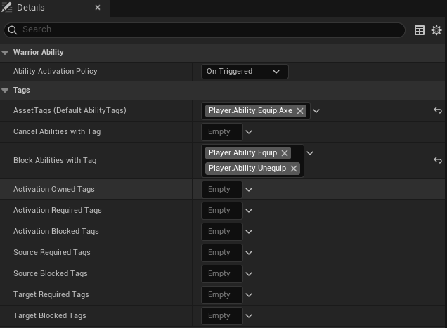
  </p>

  <p align="center">
    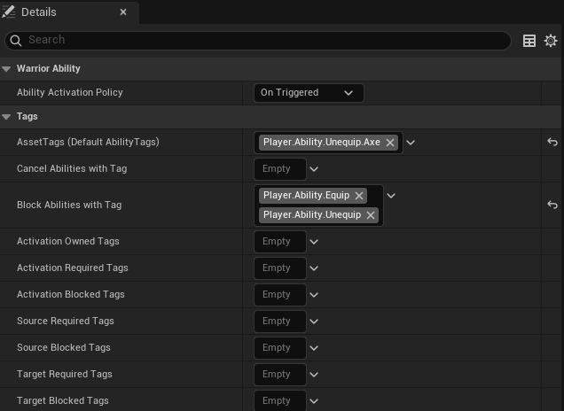
  </p>

# Ability Input Binding

上面定义的 Ability Tag 只用于 Gameplay Ability 之间的状态判定。还需要使用 Input Tag 进行输入绑定，实现按下按键后激活 Gameplay Ability。Input Tag 与 Input Action 关联，Gameplay Ability 在被授予给角色时持有激活所需的 Input Tag。IA 触发后，回调函数将 Input Tag 作为参数传递给 AbilitySystemComponent，ASC 激活持有相同 Input Tag 的 Gameplay Ability。

增加新的 `InputTag.EquipAxe`，`InputTag.UnequipAxe`。

```C++
// WarriorGameplayTags.h
namespace WarriorGameplayTags 
{
    /** Input Tags **/
    // ......
    WARRIOR_API UE_DECLARE_GAMEPLAY_TAG_EXTERN(InputTag_EquipAxe);
    WARRIOR_API UE_DECLARE_GAMEPLAY_TAG_EXTERN(InputTag_UnequipAxe);
}

// WarriorGameplayTags.cpp
namespace WarriorGameplayTags
{
    /** Input Tags **/
    // ......
    UE_DEFINE_GAMEPLAY_TAG(InputTag_EquipAxe, "InputTag.EquipAxe");
    UE_DEFINE_GAMEPLAY_TAG(InputTag_UnequipAxe, "InputTag.UnequipAxe");
}
```

## 授予 GA_EquipAxe 时添加 Input Tag

新建 WarriorStructTypes 方便写结构体函数。用 FWarriorHeroAbilitySet 结构体关联 Gameplay Ability 和对应的 Input Tag。

```C++
// WarriorTypes/WarriorStructTypes.h
#pragma once
#include "GameplayTagContainer.h"
#include "WarriorStructTypes.generated.h"

class UWarriorGameplayAbility;

USTRUCT(BlueprintType)
struct FWarriorHeroAbilitySet
{
	GENERATED_BODY()

	UPROPERTY(EditDefaultsOnly, BlueprintReadOnly, meta = (Categories = "InputTag"))
	FGameplayTag InputTag;

	UPROPERTY(EditDefaultsOnly, BlueprintReadOnly)
	TSubclassOf<UWarriorGameplayAbility> AbilityToGrant;

	bool IsValid() const;
};

// WarriorStructTypes.cpp
#include "WarriorTypes/WarriorStructTypes.h"
#include "AbilitySystem/Abilities/WarriorGameplayAbility.h"

bool FWarriorHeroAbilitySet::IsValid() const
{
    return InputTag.IsValid() && AbilityToGrant;
}
```

扩展 DataAsset_HeroStartUpData，之前 DataAsset_StartUpDataBase 中定义了 `ActivateOnGivenAbilities` 与 `ReactiveAbilities`。在 DataAsset_HeroStartUpData 中增加 `TArray<FWarriorHeroAbilitySet> HeroStartUpAbilitySets`，初始时就被授予的主角能力。重写 `GiveToAbilitySystemComponent`，遍历这个列表，每一个 Ability 用 `AbilitySpec.DynamicAbilityTags.AddTag(AbilitySet.InputTag)` 打上 Input Tag，然后授予主角。

```C++
// DataAssets/StartUpData/DataAsset_HeroStartUpData.h
#pragma once
#include "CoreMinimal.h"
#include "DataAssets/StartUpData/DataAsset_StartUpDataBase.h"
#include "WarriorTypes/WarriorStructTypes.h"
#include "DataAsset_HeroStartUpData.generated.h"

UCLASS()
class WARRIOR_API UDataAsset_HeroStartUpData : public UDataAsset_StartUpDataBase
{
	GENERATED_BODY()
public:
	virtual void GiveToAbilitySystemComponent(UWarriorAbilitySystemComponent* InASCToGive, int32 ApplyLevel = 1) override;
private:
	UPROPERTY(EditDefaultsOnly, Category = "StartUpData", meta = (TitleProperty = "InputTag"))
	TArray<FWarriorHeroAbilitySet> HeroStartUpAbilitySets;
};

// DataAsset_HeroStartUpData.cpp
#include "DataAssets/StartUpData/DataAsset_HeroStartUpData.h"
#include "AbilitySystem/WarriorAbilitySystemComponent.h"
#include "AbilitySystem/Abilities/WarriorGameplayAbility.h"

void UDataAsset_HeroStartUpData::GiveToAbilitySystemComponent(UWarriorAbilitySystemComponent* InASCToGive, int32 ApplyLevel)
{
    Super::GiveToAbilitySystemComponent(InASCToGive, ApplyLevel);
    for (const FWarriorHeroAbilitySet& AbilitySet : HeroStartUpAbilitySets)
    {
        if (!AbilitySet.IsValid()) continue;
        FGameplayAbilitySpec AbilitySpec(AbilitySet.AbilityToGrant);
        AbilitySpec.SourceObject = InASCToGive->GetAvatarActor();
        AbilitySpec.Level = ApplyLevel;
        AbilitySpec.DynamicAbilityTags.AddTag(AbilitySet.InputTag);
        InASCToGive->GiveAbility(AbilitySpec);
    }
}
```

  <p align="center">
    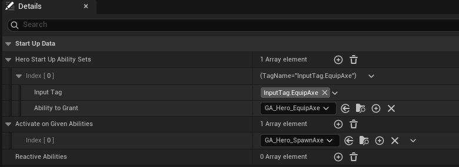
  </p>

GA_Hero_EquipAxe 是角色开始时就拥有的能力，GA_Hero_UnequipAxe 是装备武器后才授予的能力，因此这里 HeroStartUpData 只配置了 GA_Hero_EquipAxe。主角被授予 GA_Hero_EquipAxe 时，GA_Hero_EquipAxe 会拥有 `InputTag.EquipAxe`。

## 绑定 InputTag

Ability Input Actions 绑定步骤与之前的 NativeInputActions 类似，在 Input Config Data Asset 中映射 InputTag 到 IA。在 Input Component 中定义新的绑定函数，在 Character 中进行绑定，定义回调函数。最后在 Editor 中配置资产。

DataAsset_InputConfig 中用元素类型为 `FWarriorInputActionConfig` 的列表`NativeInputActions` 保存了 `InputTag.Move`，`InputTag.Look` 等 Tag 对应的 InputAction。扩展 DataAsset_InputConfig，用列表 `AbilityInputActions` 保存另外与 Ability 相关的 Input Action。

```C++
// DataAssets/Input/DataAsset_InputConfig.h
USTRUCT(BlueprintType)
struct FWarriorInputActionConfig
{
	GENERATED_BODY()
public:
	UPROPERTY(EditDefaultsOnly, BlueprintReadOnly, meta = (Categories = "InputTag"))
	FGameplayTag InputTag;

	UPROPERTY(EditDefaultsOnly, BlueprintReadOnly)
	TObjectPtr<UInputAction> InputAction;

	bool IsValid() const
	{
		return InputTag.IsValid() && InputAction;
	}
};

UCLASS()
class WARRIOR_API UDataAsset_InputConfig : public UDataAsset
{
	GENERATED_BODY()
public:
    // ......
	UPROPERTY(EditDefaultsOnly, BlueprintReadOnly, meta = (TitleProperty = "InputAction"))
	TArray<FWarriorInputActionConfig> AbilityInputActions;
};
```

在 WarriorInputComponent 中为 AbilityInputActions 提供一个模板绑定函数。BindAction 在 Func 后面的参数是额外绑定参数（payload），触发时会一并传给回调。
因此这里的 AbilityInputActionConfig.InputTag 会作为 InputReleasedFunc 的实参传入。

```C++
// Components/Input/WarriorInputComponent.h
template<class UserObject, typename CallbackFunc>
inline void UWarriorInputComponent::BindAbilityInputAction(const UDataAsset_InputConfig* InInputConfig, UserObject* ContextObject, CallbackFunc InputPressedFunc, CallbackFunc InputReleasedFunc)
{
	checkf(InInputConfig, TEXT("Input config data asset is null, can not proceed with binding"));

	for (const FWarriorInputActionConfig& AbilityInputActionConfig : InInputConfig->AbilityInputActions)
	{
		if (!AbilityInputActionConfig.IsValid()) continue;

		BindAction(AbilityInputActionConfig.InputAction, ETriggerEvent::Started, ContextObject, InputPressedFunc, AbilityInputActionConfig.InputTag);
		BindAction(AbilityInputActionConfig.InputAction, ETriggerEvent::Completed, ContextObject, InputReleasedFunc, AbilityInputActionConfig.InputTag);
	}
}
```

  <p align="center">
    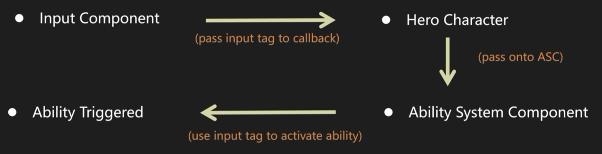
  </p>

显然这些 Ability 的逻辑不在 Character 中，而在各自的 GA 蓝图里。NativeInputActions 的回调函数写在 Character 中，与 IA 一一对应。AbilityInputActions 中的所有 Ability 使用同一套 Pressed/Released 回调，靠输入参数 InputTag 区分是 Equip 还是 Unequip，不必为每个 IA 各写一个函数。在 `SetupPlayerInputComponent` 中调用 `BindAbilityInputAction` 完成绑定。回调函数调用 `WarriorAbilitySystemComponent` 组件的响应函数，激活 InputTag 对应的 GA。

```C++
// Characters/WarriorHeroCharacter.h
struct FGameplayTag;

UCLASS()
class WARRIOR_API AWarriorHeroCharacter : public AWarriorBaseCharacter
{
    // ......
private:
#pragma region Input
	UPROPERTY(EditDefaultsOnly, BlueprintReadOnly, Category = "CharacterData", meta = (AllowPrivateAccess = "true"))
	TObjectPtr<UDataAsset_InputConfig> InputConfigDataAsset;

	void Input_Move(const FInputActionValue& InputActionValue);
	void Input_Look(const FInputActionValue& InputActionValue);
	void Input_AbilityInputPressed(FGameplayTag InInputTag);
	void Input_AbilityInputReleased(FGameplayTag InInputTag);
#pragma endregion

// WarriorHeroCharacter.cpp
void AWarriorHeroCharacter::SetupPlayerInputComponent(UInputComponent* PlayerInputComponent)
{
    // ......
    WarriorInputComponent->BindNativeInputAction(InputConfigDataAsset, WarriorGameplayTags::InputTag_Move, ETriggerEvent::Triggered, this, &ThisClass::Input_Move);

    WarriorInputComponent->BindNativeInputAction(InputConfigDataAsset, WarriorGameplayTags::InputTag_Look, ETriggerEvent::Triggered, this, &ThisClass::Input_Look);

    WarriorInputComponent->BindAbilityInputAction(InputConfigDataAsset, this, &ThisClass::Input_AbilityInputPressed, &ThisClass::Input_AbilityInputReleased);
}

void AWarriorHeroCharacter::Input_AbilityInputPressed(FGameplayTag InInputTag)
{
    WarriorAbilitySystemComponent->OnAbilityInputPressed(InInputTag);
}

void AWarriorHeroCharacter::Input_AbilityInputReleased(FGameplayTag InInputTag)
{
    WarriorAbilitySystemComponent->OnAbilityInputReleased(InInputTag);
}
```

`WarriorAbilitySystemComponent` 组件收到 `InputTag` 后用 `GetActivatableAbilities` 获取当前拥有的 GA，如果 GA 持有输入的 InputTag 则激活，然后触发 GA 蓝图中激活后的具体逻辑。

```C++
// AbilitySystem/WarriorAbilitySystemComponent.h
#pragma once
#include "CoreMinimal.h"
#include "AbilitySystemComponent.h"
#include "WarriorTypes/WarriorStructTypes.h"
#include "WarriorAbilitySystemComponent.generated.h"

UCLASS()
class WARRIOR_API UWarriorAbilitySystemComponent : public UAbilitySystemComponent
{
	GENERATED_BODY()
public:
	void OnAbilityInputPressed(const FGameplayTag& InInputTag);
	void OnAbilityInputReleased(const FGameplayTag& InInputTag);
};

// WarriorAbilitySystemComponent.cpp
#include "AbilitySystem/WarriorAbilitySystemComponent.h"
#include "AbilitySystem/Abilities/WarriorGameplayAbility.h"

void UWarriorAbilitySystemComponent::OnAbilityInputPressed(const FGameplayTag& InInputTag)
{
    if (!InInputTag.IsValid()) return;

    for (const FGameplayAbilitySpec& AbilitySpec : GetActivatableAbilities())
    {
        if (!AbilitySpec.DynamicAbilityTags.HasTagExact(InInputTag)) continue;

        TryActivateAbility(AbilitySpec.Handle);
    }
}

void UWarriorAbilitySystemComponent::OnAbilityInputReleased(const FGameplayTag & InInputTag)
{
    // pass
}
```

创建 IA_EquipAxe，IA_UnequipAxe 文件，类型都是 `bool`，在编辑器配置文件 DA_InputConfig 中将 InputTag 与 IA 关联。代表空手状态的 Default IMC 中只添加 IA_EquipAxe，在按键 “1” 时触发。

# 装备、卸下武器

GA_Hero_EquipAxe 激活时先播放从背后拿武器的 Montage 动画，当手触碰到武器的时刻用 notify 发送一个 Event Gameplay Tag 给 Actor。GA_Hero_EquipAxe 在 Actor 接收到这个 Event 之后把武器切换插槽绑到手上，然后可以用一个蓝图函数处理武器相关的逻辑。GA_Hero_UnequipAxe 与之相似。

## Play Montage

从 Equip Axe 动画资产创建 Montage 动画 AM_Hero_Axe_Equip，Enable Root Motion 选择关闭，因为装备和卸下都是上肢动作，不影响下肢移动。如果动画要接管移动组件，覆盖全身则勾上，比如攻击。创建一个动画插槽 `UpperBodySlot`，ABP 里的 Slot 节点声明这里允许 Montage 介入，Montage 上的 Slot 声明要插到哪个插槽。当播放 Montage 动画时，根据插槽把 Montage 插入 ABP。

在 ABP 中上半身用 Slot 接入 Montage，下半身保持原来的 Locomotion，用 Layered Blend Per Bone 节点进行混合。不播放 Montage 时正常输出 Locomotion，播放时接管 Slot。

  <p align="center">
    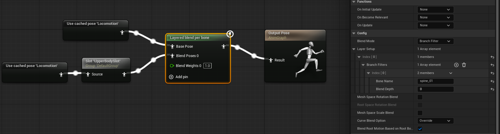
  </p>

## Anim Event

需要一个动画事件在 Montage 播放到手触碰武器时通知 Actor，这个信号也由 Gameplay Tag 完成。声明 `Player.Event.Equip.Axe`，`Player.Event.Unequip.Axe`。

```C++
// WarriorGameplayTags.h
namespace WarriorGameplayTags 
{
    /** Player Tags **/
    WARRIOR_API UE_DECLARE_GAMEPLAY_TAG_EXTERN(Player_Event_Equip_Axe);
    WARRIOR_API UE_DECLARE_GAMEPLAY_TAG_EXTERN(Player_Event_Unequip_Axe);
}

// WarriorGameplayTags.cpp
#include "WarriorGameplayTags.h"

namespace WarriorGameplayTags
{
    /** Player Tags **/
    UE_DEFINE_GAMEPLAY_TAG(Player_Event_Equip_Axe, "Player.Event.Equip.Axe");
    UE_DEFINE_GAMEPLAY_TAG(Player_Event_Unequip_Axe, "Player.Event.Unequip.Axe");
}
```

在 UE 中基于 Anim Notify 自定义蓝图 AN_SendGameplayTag，重写 Received Notify，获取 Actor，然后向 Actor 发送 Event Tag。将 Event Tag 提升为 public 变量，可以在 AN 实例中修改。

  <p align="center">
    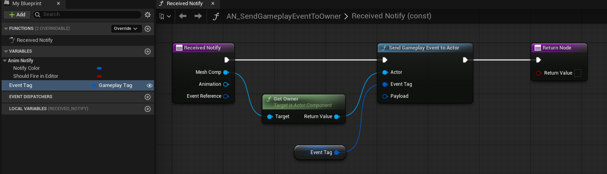
  </p>

在 Montage 动画中的触发帧打上 AN 实例，发送 `Player.Event.Equip.Axe`。

  <p align="center">
    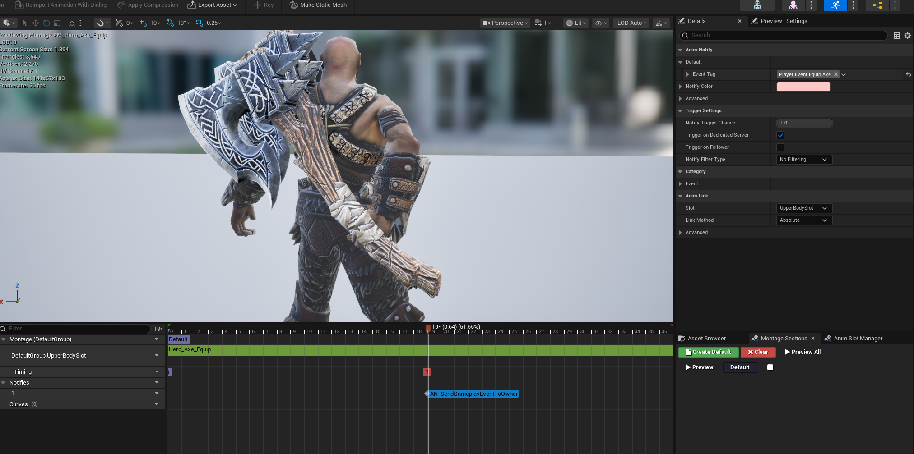
  </p>

在 GA_Hero_EquipAxe 中播放对应 Montage 并等待 `Player.Event.Equip.Axe` 事件。然后获取 `HeroCombatComponent`，根据 `Player.Weapon.Axe` 拿到角色拥有的武器，Attach 到骨骼插槽 `AxeRightHandSocket`。

  <p align="center">
    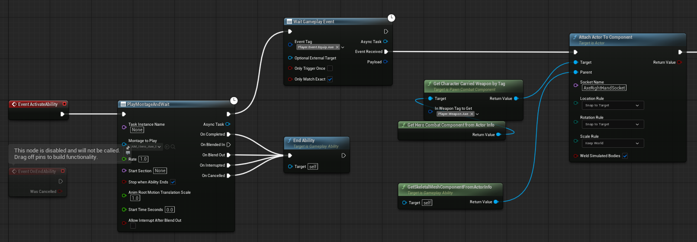
  </p>

## Animation Layer

  <p align="center">
    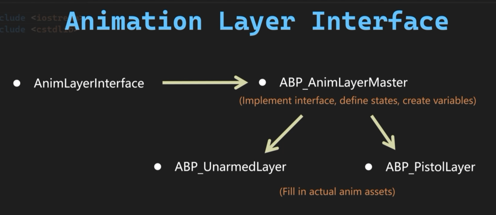
  </p>

当角色持有不同武器时，会有不同的 Locomotion 动画，如果直接在 ABP 中修改节点会难以维护。解决方法是使用 Animation Layer。在 UE 中创建一个 Animation Layer Interface，命名为 ALI_Hero，在其中添加 ArmedLocomotionState，代表持械动画。Animation Layer Interface 定义有哪些可替换的动画层函数，主 ABP 只声明这里播某一层，具体实现由别的 Linked AnimBP 提供。

在 ABP 中实现这个动画接口，用 PropertAccess 节点获取 `CombatComponent` 中的 `CurrentEquippedWeaponTag`，如果为空则是空手状态，否则是持械状态。以此作为 bool 输入控制是否使用 ArmedLocomotionLayer。

  <p align="center">
    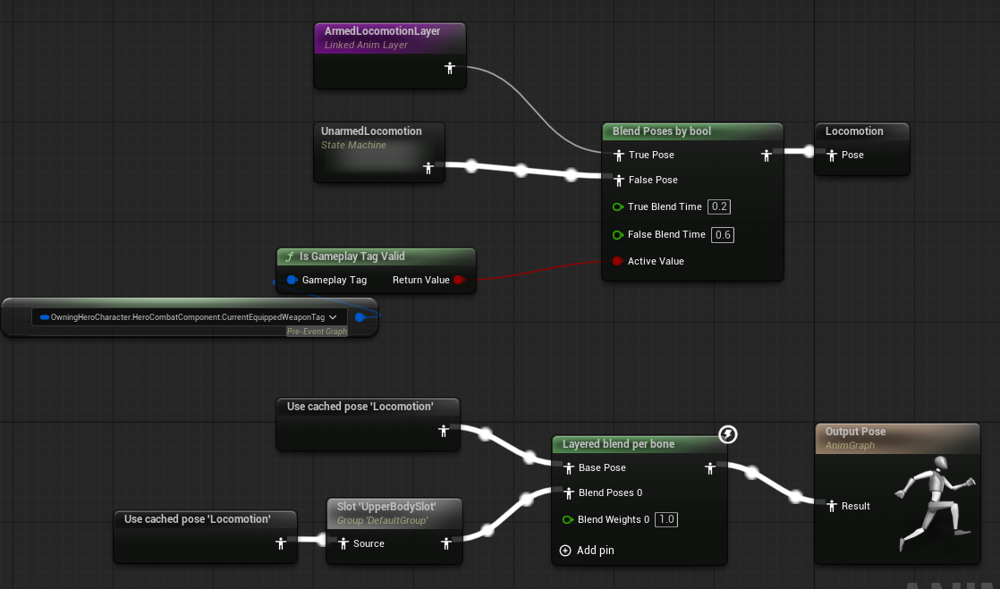
  </p>

在 UE 中以相同的骨骼模型继承 WarriorHeroLinkedAnimLayer 创建一个 ABP，命名为 MasterAnimLayer_Hero，实现 ALI_Hero 接口并提供 ArmedLocomotionState 的具体实现。因为 WarriorHeroLinkedAnimLayer 继承自 WarriorBaseAnimInstance，这里 PropertyAccess 访问不到 GroundSpeed。在 WarriorHeroLinkedAnimLayer 里增加一个蓝图线程安全的 BlueprintPure 函数从主 ABP 中得到 GroundSpeed。

  <p align="center">
    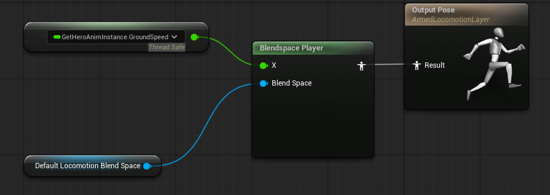
  </p>

```C++
// AnimInstances/Hero/WarriorHeroLinkedAnimLayer.h
#pragma once
#include "CoreMinimal.h"
#include "AnimInstances/WarriorBaseAnimInstance.h"
#include "WarriorHeroLinkedAnimLayer.generated.h"

class UWarriorHeroAnimInstance;

UCLASS()
class WARRIOR_API UWarriorHeroLinkedAnimLayer : public UWarriorBaseAnimInstance
{
	GENERATED_BODY()
public:
	UFUNCTION(BlueprintPure, meta = (BlueprintThreadSafe))
	UWarriorHeroAnimInstance* GetHeroAnimInstance() const;
};

// AnimInstances/Hero/WarriorHeroLinkedAnimLayer.cpp
#include "AnimInstances/Hero/WarriorHeroLinkedAnimLayer.h"
#include "AnimInstances/Hero/WarriorHeroAnimInstance.h"

UWarriorHeroAnimInstance* UWarriorHeroLinkedAnimLayer::GetHeroAnimInstance() const
{
    return Cast<UWarriorHeroAnimInstance>(GetOwningComponent()->GetAnimInstance());
}
```

MasterAnimLayer_Hero 只是提供了逻辑定义，基于此创建子蓝图 AnimLayer_HeroAxe，配置 BlendSpace 动作资产。

## Weapon Data

回顾需求，在 GA_Hero_EquipAxe 触发事件切换武器插槽后，还需要处理三部分逻辑：添加新的 IMC、授予武器能力、连接 AnimLayer。一开始输入 “1” 装备武器，装备状态再输入变成卸下武器，需要添加一个新的 IMC 并设置权重以覆盖，并在卸下后移除这个 IMC。不同武器可以使用不同的 GA，只有在已装备状态才能卸下武器，因此 GA_Hero_UnequipAxe 是在装备上武器后才授予角色的，并不是角色 StartUpData 一开始就有的能力。角色在空手与持械状态有不同的移动动画，目前已经在主 ABP 中实现了动画接口，调用了 ArmedLocomotionState；然后在 MasterAnimLayer_Hero 中实现了具体逻辑，在 AnimLayer_HeroAxe 中配置动作资产，还需要在 GA_Hero_EquipAxe 中连接 AnimLayer_HeroAxe。这些资产都和 Weapon 相关，在 WarriorStructTypes 里增加一个 FWarriorHeroWeaponData 结构体。

```C++
// WarriorTypes/WarriorStructTypes.h
USTRUCT(BlueprintType)
struct FWarriorHeroWeaponData
{
    GENERATED_BODY()

    UPROPERTY(EditDefaultsOnly, BlueprintReadOnly)
    TSubclassOf<UWarriorHeroLinkedAnimLayer> WeaponAnimLayerToLink;

	UPROPERTY(EditDefaultsOnly, BlueprintReadOnly)
	TObjectPtr<UInputMappingContext> WeaponInputMappingContext;

	UPROPERTY(EditDefaultsOnly, BlueprintReadOnly, meta = (TitleProperty = "InputTag"))
	TArray<FWarriorHeroAbilitySet> DefaultWeaponAbilities;
};
```

在 WarriorHeroWeapon 中拥有这个结构体。FGameplayAbilitySpecHandle 是 GAS 里某一条已授予能力（FGameplayAbilitySpec）的句柄，`GrantedAbilitySpecHandle` 记录了由武器给出的所有 GA 句柄，方便在 GA_Hero_UnequipAxe 中清除这些武器带来的 GA，而不影响其他 GA。

```C++
// Items/Weapons/WarriorHeroWeapon.h
#pragma once
#include "CoreMinimal.h"
#include "Items/Weapons/WarriorWeaponBase.h"
#include "WarriorTypes/WarriorStructTypes.h"
#include "GameplayAbilitySpecHandle.h"
#include "WarriorHeroWeapon.generated.h"

UCLASS()
class WARRIOR_API AWarriorHeroWeapon : public AWarriorWeaponBase
{
	GENERATED_BODY()
public:
	UPROPERTY(EditDefaultsOnly, BlueprintReadOnly, Category = "WeaponData")
	FWarriorHeroWeaponData HeroWeaponData;

	UFUNCTION(BlueprintCallable)
	void AssignGrantedAbilitySpecHandles(const TArray<FGameplayAbilitySpecHandle>& InSpecHandles);

	UFUNCTION(BlueprintPure)
	TArray<FGameplayAbilitySpecHandle> GetGrantedAbilitySpecHandles() const;
private:
	TArray<FGameplayAbilitySpecHandle> GrantedAbilitySpecHandle;
};

// WarriorHeroWeapon.cpp
#include "Items/Weapons/WarriorHeroWeapon.h"

void AWarriorHeroWeapon::AssignGrantedAbilitySpecHandles(const TArray<FGameplayAbilitySpecHandle>& InSpecHandles)
{
    GrantedAbilitySpecHandle = InSpecHandles;
}

TArray<FGameplayAbilitySpecHandle> AWarriorHeroWeapon::GetGrantedAbilitySpecHandles() const
{
    return GrantedAbilitySpecHandle;
}
```

配置 BP_HeroAxe 的 WeaponData。

  <p align="center">
    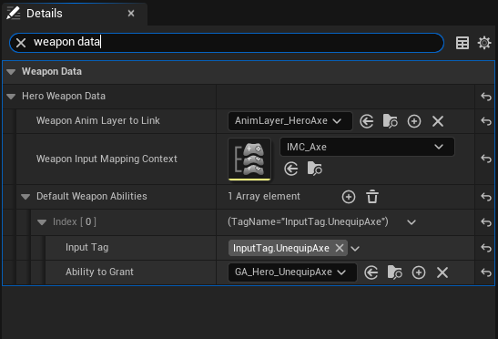
  </p>

在 WarriorAbilitySystemCompinent 中提供两个函数 `GrantHeroWeaponAbilities`，`RemoveGrantedHeroWeaponAbilities` 供 GA_Hero_EquipAxe 和 GA_Hero_UnequipAxe 使用。`GiveAbility(AbilitySpec)` 的返回值就是 FGameplayAbilitySpecHandle。`RemoveGrantedHeroWeaponAbilities` 使用引用传参，没有 `UPARAM(ref)` 蓝图往往把非 const 引用当成普通输入，加上之后，蓝图传入的数组会真正被函数修改并写回。

```C++
// AbilitySystem/WarriorAbilitySystemCompinent.h
#pragma once
#include "CoreMinimal.h"
#include "AbilitySystemComponent.h"
#include "WarriorTypes/WarriorStructTypes.h"
#include "WarriorAbilitySystemComponent.generated.h"

UCLASS()
class WARRIOR_API UWarriorAbilitySystemComponent : public UAbilitySystemComponent
{
	GENERATED_BODY()
public:
	// ......
	UFUNCTION(BlueprintCallable, Category = "Warrior|Ability", meta = (ApplyLevel = "1"))
	void GrantHeroWeaponAbilities(const TArray<FWarriorHeroAbilitySet>& InDefaultWeaponAbilities, int32 ApplyLevel, TArray<FGameplayAbilitySpecHandle>& OutGrantedAbilitySpecHandles);

	UFUNCTION(BlueprintCallable, Category = "Warrior|Ability")
	void RemoveGrantedHeroWeaponAbilities(UPARAM(ref)TArray<FGameplayAbilitySpecHandle>& InSpecHandlesToRemove);
};

// WarriorAbilitySystemCompinent.cpp
void UWarriorAbilitySystemComponent::GrantHeroWeaponAbilities(const TArray<FWarriorHeroAbilitySet>& InDefaultWeaponAbilities, int32 ApplyLevel, TArray<FGameplayAbilitySpecHandle>& OutGrantedAbilitySpecHandles)
{
    if (InDefaultWeaponAbilities.IsEmpty())
    {
        return;
    }

    for (const FWarriorHeroAbilitySet& AbilitySet : InDefaultWeaponAbilities)
    {
        if (!AbilitySet.IsValid()) continue;

        FGameplayAbilitySpec AbilitySpec(AbilitySet.AbilityToGrant);
        AbilitySpec.SourceObject = GetAvatarActor();
        AbilitySpec.Level = ApplyLevel;
        AbilitySpec.DynamicAbilityTags.AddTag(AbilitySet.InputTag);

        OutGrantedAbilitySpecHandles.AddUnique(GiveAbility(AbilitySpec));
    }
}

void UWarriorAbilitySystemComponent::RemoveGrantedHeroWeaponAbilities(UPARAM(ref)TArray<FGameplayAbilitySpecHandle>& InSpecHandlesToRemove)
{
    if (InSpecHandlesToRemove.IsEmpty())
    {
        return;
    }

    for (const FGameplayAbilitySpecHandle& SpecHandle : InSpecHandlesToRemove)
    {
        if (SpecHandle.IsValid())
        {
            ClearAbility(SpecHandle);
        }
    }
    InSpecHandlesToRemove.Empty();
}
```

用一个蓝图函数整理武器相关的逻辑，传入 Weapon 引用，在函数里缓存 WeaponData。

  <p align="center">
    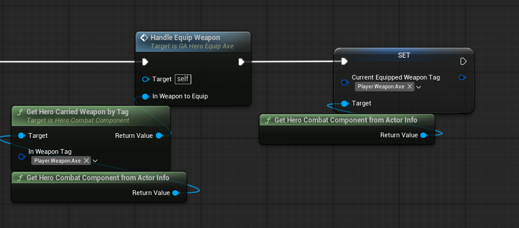
  </p>

连接动画层，一个角色只能有一个 `SkeletalMeshComponent` 组件。Linked Anim Layer 不是另挂一套网格上的独立动画机，而是挂在同一个 `USkeletalMeshComponent` 上的附加 AnimInstance 层。引擎按 Interface 创建（或复用）一份 Linked AnimInstance，登记到主实例的 Linked Layer 映射里。有 Link 用 Linked 的图，没有则用主 ABP 自己的默认实现。

  <p align="center">
    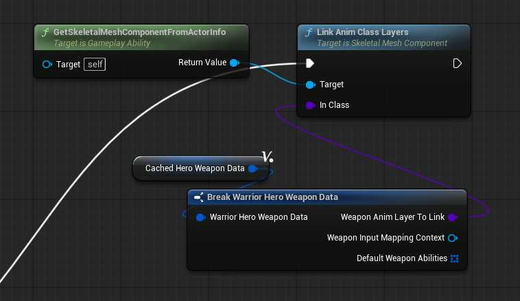
  </p>

调用 `GrantHeroWeaponAbilities` 授予武器能力，目前只有卸下武器一个。蓝图把带 const 的解释成输入引脚，把不带 const 的引用解释为输出引脚。保存授予能力的句柄。

  <p align="center">
    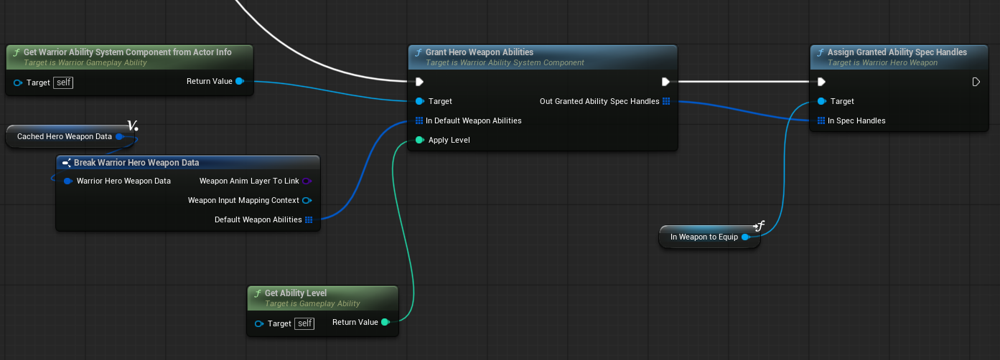
  </p>

添加新的 IMC 文件，IMC 将 “1” 映射为 IA_UnequipAxe，权重为 1 以覆盖原来的 Default IMC。

  <p align="center">
    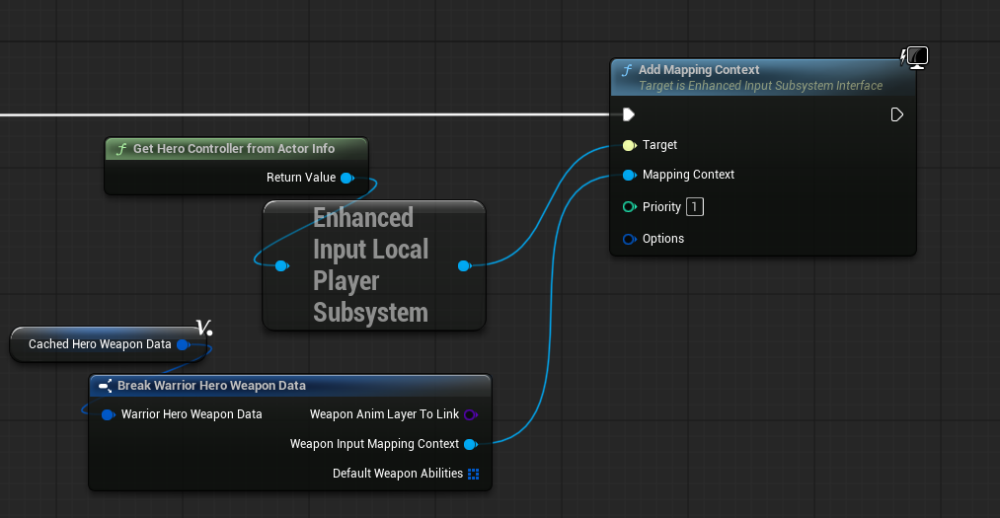
  </p>

UnequipAxe 的逻辑与 EquipAxe 相似，不过添加 IMC 变成删去 IMC，连接变成 Unlink，最后调用 `RemoveGrantedHeroWeaponAbilities` 清空武器能力。
