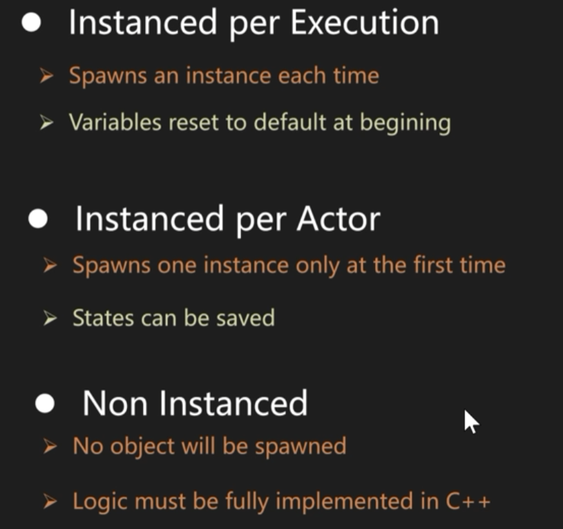
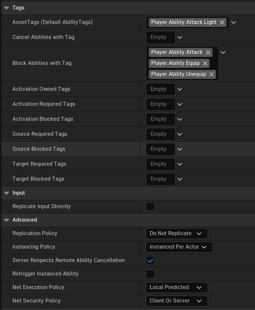
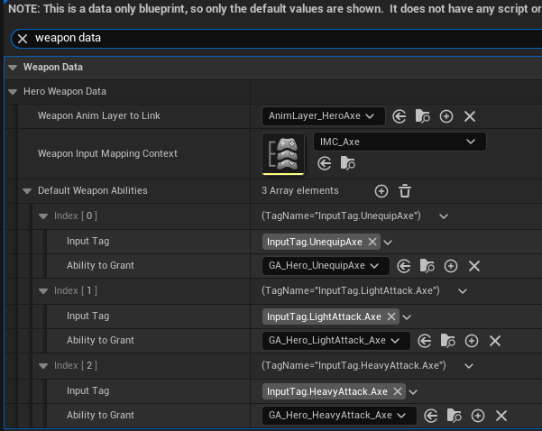
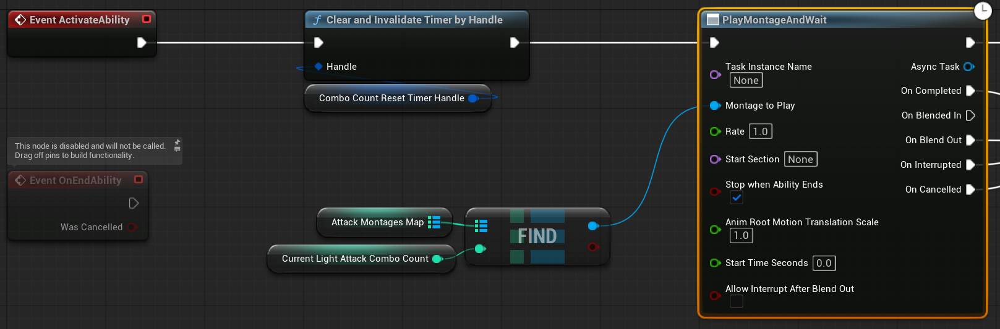
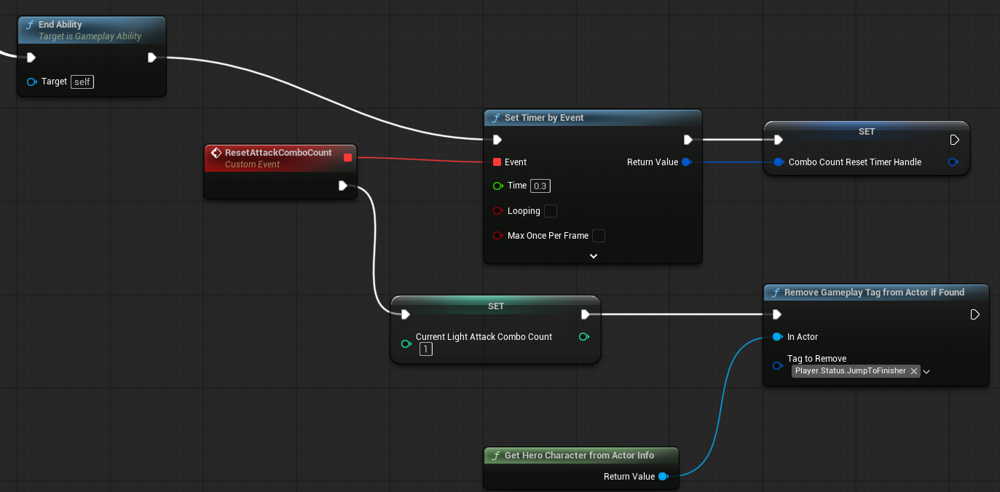
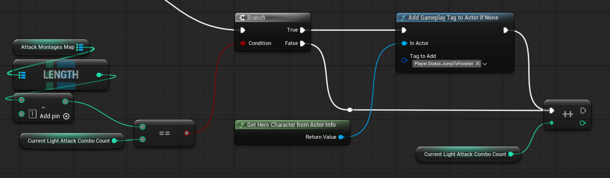
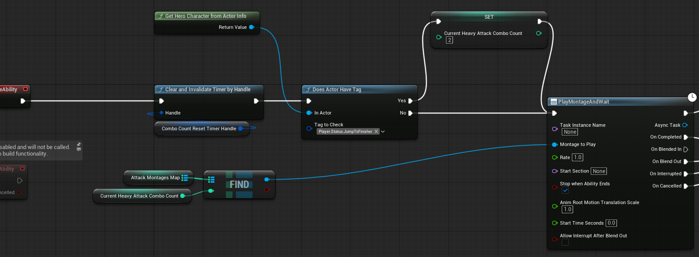
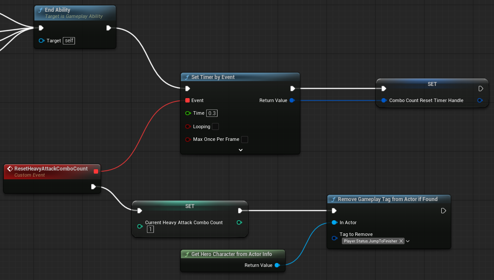

# 需求

这一节让角色可以使用斧子进行轻击、重击、连段等战斗操作。玩家按下鼠标左键轻击，按下右键重击；轻击共有四段，重击两段，当超过一定时间没有继续输入则会重新计数；当玩家打出轻击第三段后可以直接进行重击第二段，然后重新计数。

# Ability Instancing Policy

继续选择 GAS 系统来实现，创建 Ability 蓝图后一个需要注意的点是 Ability Instancing Policy。UE 共有如下三种 Ability 实例化策略。

  <p align="center">
    
  </p>

第一种每次执行时实例，如果频繁使用会导致性能浪费，而且会为变量重置初始值；第二种只在初始时进行一次实例化，变量值可以保存；第三种不需要实例化，性能最好，但是逻辑必须在 C++ 中实现，蓝图只能配变量数值。要实现连段，必须要在 GA 蓝图里使用一个变量计数，因此这里使用 Instanced per actor 最合适。

考虑将 GA 的逻辑和数据分离，先基于 WarriorHeroGameplayAbility C++ 类创建蓝图 GA_Hero_LightAttackMaster，GA_Hero_HeavyAttackMaster，这里只写逻辑。然后分别创建 GA_Hero_LightAttack_Axe，GA_Hero_HeavyAttack_Axe，这里不写逻辑只配置相应的 Montage 动画资产。

参考上一篇的流程，为轻击、重击定义 Ability Tag 和 Input Tag。这两个能力都是可以反复触发的 `OnTriggered` 能力。在 GA 编辑器面板中配置 Tags， `Attack` `Equip` `Unequip` 三种 Tag 类型相互阻断。将 Instancing policy 设为 per actor。

  <p align="center">
    
  </p>

轻击、重击都是在拔出武器后才授予角色的能力，在武器 Axe 蓝图面板配置 Input Tag 和 Ability。

  <p align="center">
    
  </p>

创建相应的 Input Action，在 IMC_Axe 中增加映射，在 DA_InputConfig 中配置 IA 和 Input Tag。

# 轻击、重击

在 GA 蓝图里写轻重击的逻辑。用一个 int 类型的变量 `Current Light Attack Combo Count` 查找由 Map 结构组织的轻击 Montage 动画。Montage 播放结束后用 Set Timer by Event 节点判断一定时间内是否挥出下一击，如果没连上就重置计数，连上了就清除计时。维护 `Current Light Attack Combo Count`，每次播放完自增，如果播完最后一个动画重置为 1。重击逻辑与之类似。

  <p align="center">
    
  </p>

  <p align="center">
    
  </p>

# 用 Gameplay Tag 实现连段 

下面实现在轻击第三段后可以直接使用重击第二段的逻辑。在条件达成后给角色添加一个表示可以重击的状态 GameplayTag `Player.Status.JumpToFinisher`。在重击 GA 中先判断角色是否拥有这个状态。如果有，将 Count 设为 2；如果没有则按原先的逻辑。角色在持有此状态时，之后接上第二段重击或者直接使用第四段轻击，或者超过连段时间导致触发 Count 清空，则会解除此状态。

先写一些函数方便在蓝图中给角色增减 Tag。继承 BlueprintFunctionLibrary 创建 WarriorFunctionLibrary。

```c++
// WarriorFunctionLibrary.h
#pragma once
#include "CoreMinimal.h"
#include "Kismet/BlueprintFunctionLibrary.h"
#include "WarriorFunctionLibrary.generated.h"

class UWarriorAbilitySystemComponent;

UENUM()
enum class EWarriorConfirmType : uint8
{
	Yes,
	No
};

UCLASS()
class WARRIOR_API UWarriorFunctionLibrary : public UBlueprintFunctionLibrary
{
	GENERATED_BODY()
	
public:
	static UWarriorAbilitySystemComponent* NativeGetWarriorASCFromActor(AActor* InActor);

	UFUNCTION(BlueprintCallable, Category = "Warrior|FunctionLibrary")
	static void AddGameplayTagToActorIfNone(AActor* InActor, FGameplayTag TagToAdd);

	UFUNCTION(BlueprintCallable, Category = "Warrior|FunctionLibrary")
	static void RemoveGameplayTagFromActorIfFound(AActor* InActor, FGameplayTag TagToRemove);

	static bool NativeDoesActorHaveTag(AActor* InActor, FGameplayTag TagToCheck);

	UFUNCTION(BlueprintCallable, Category = "Warrior|FunctionLibrary", meta = (DisplayName = "Does Actor Have Tag", ExpandEnumAsExecs = "OutConfirmType"))
	static void BP_DoesActorHaveTag(AActor* InActor, FGameplayTag TagToCheck, EWarriorConfirmType& OutConfirmType);
};


// WarriorFunctionLibrary.cpp
#include "WarriorFunctionLibrary.h"
#include "AbilitySystem/WarriorAbilitySystemComponent.h"
#include "AbilitySystemBlueprintLibrary.h"

UWarriorAbilitySystemComponent* UWarriorFunctionLibrary::NativeGetWarriorASCFromActor(AActor* InActor)
{
    check(InActor);

    return CastChecked<UWarriorAbilitySystemComponent>(UAbilitySystemBlueprintLibrary::GetAbilitySystemComponent(InActor));
}

void UWarriorFunctionLibrary::AddGameplayTagToActorIfNone(AActor* InActor, FGameplayTag TagToAdd)
{
    UWarriorAbilitySystemComponent* ASC = NativeGetWarriorASCFromActor(InActor);

    if (!ASC->HasMatchingGameplayTag(TagToAdd)) 
    {
        ASC->AddLooseGameplayTag(TagToAdd);
    }
}

void UWarriorFunctionLibrary::RemoveGameplayTagFromActorIfFound(AActor* InActor, FGameplayTag TagToRemove)
{
    UWarriorAbilitySystemComponent* ASC = NativeGetWarriorASCFromActor(InActor);

    if (ASC->HasMatchingGameplayTag(TagToRemove)) 
    {
        ASC->RemoveLooseGameplayTag(TagToRemove);
    }
}

bool UWarriorFunctionLibrary::NativeDoesActorHaveTag(AActor* InActor, FGameplayTag TagToCheck)
{
    UWarriorAbilitySystemComponent* ASC = NativeGetWarriorASCFromActor(InActor);

    return ASC->HasMatchingGameplayTag(TagToCheck);
}

void UWarriorFunctionLibrary::BP_DoesActorHaveTag(AActor* InActor, FGameplayTag TagToCheck, EWarriorConfirmType& OutConfirmType)
{
    OutConfirmType = NativeDoesActorHaveTag(InActor, TagToCheck) ? EWarriorConfirmType::Yes : EWarriorConfirmType::No;
}
```

添加 Tag

  <p align="center">
    
  </p>

检查 Tag

  <p align="center">
    
  </p>

清除 Tag

  <p align="center">
    
  </p>

用 GameplayTag 实现轻重击之间的连段通信。
