笔者大概从小学一年级起在兴趣班学习书法，直到初一完成考级。老师虽然严格认真，但教学多以实践为主，缺少系统理论（当然，给小孩子讲书法理论估计也没人能静下心听）。那时觉得书法就是写字，重复练习，没有主动审美的意识。初中之后学业繁忙，渐渐不再写字，只在假期偶做练习，每年春节集字写写春联。本科在东南大学就读时，听闻优秀校友王澍在大学期间不懈研习书法，追寻美感，最终成为著名建筑学家的故事，于是装模做样在宿舍挥毫弄墨，最终没有坚持下来。后来一个人在香港读研，在空虚孤独、学业压力之下难以自处，于是尝试使用笔墨来排遣焦虑，重新唤醒兴趣，唤醒对生活的感觉和热爱。至此终于觉得书法真正成为了生活，乃至生命的一部分，开始感受到古人碑帖中那种惊心动魄的美感。

因为缺乏对书法的系统认识，面对碑帖常觉无从下手，于是在网上学习了北大方建勋老师的《书法审美与实践》一门公开课。课程一共三十讲，涵盖甚广，因此做笔记以整理分享。

# 引言

> “世人公认中国书法是最高艺术，就是因为它能显出惊人奇迹，无色而具画图的灿烂，无声而有音乐的和谐，引人欣赏，心畅神怡。” 
>
> —— 沈尹默《历代名家学书经验谈辑要释义》

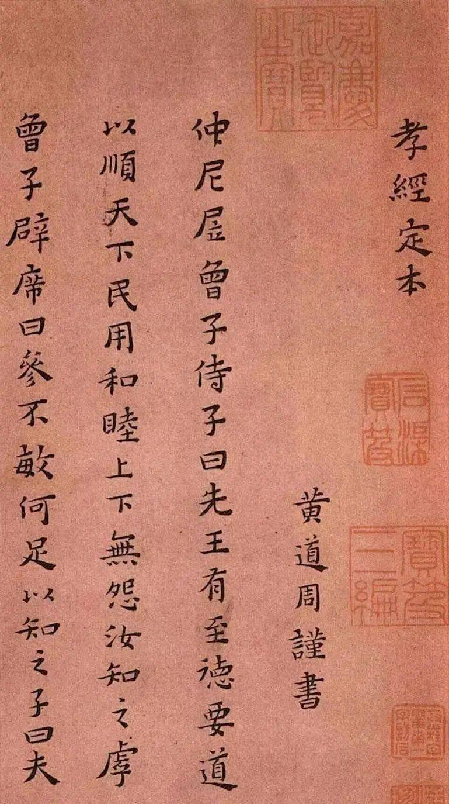

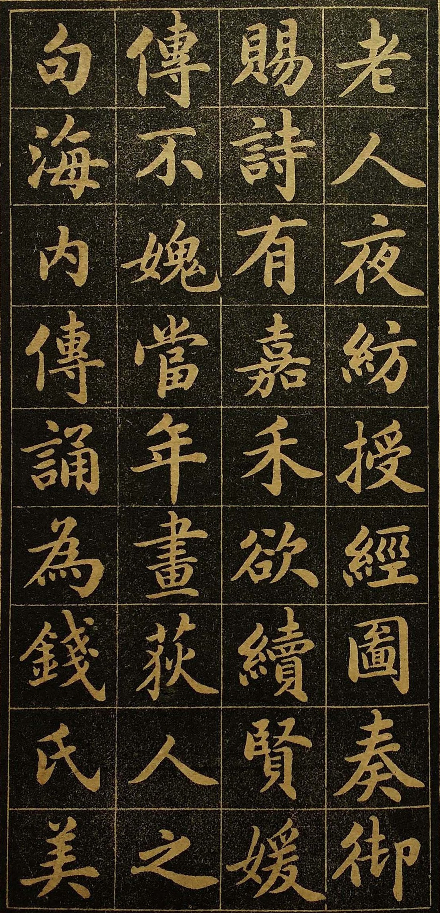

书法境界有上下之分。上面的作品是黄道周的《孝经定本》，下面的是明清流行的馆阁体。普遍认为前者的境界比后者要高，可见书法不仅仅是写好字，其背后有哲学与美学的支撑。

**本课程主要回答以下问题**

- **写毛笔字，何以成为艺术？**
- **中国书法的价值何在？**
- **现代人欣赏、研究书法有何意义？**

**本课程中书法五体（篆隶楷行草）均有涉及**

## 课程目标

### 一、体会书法之美

书法之美犹在多姿

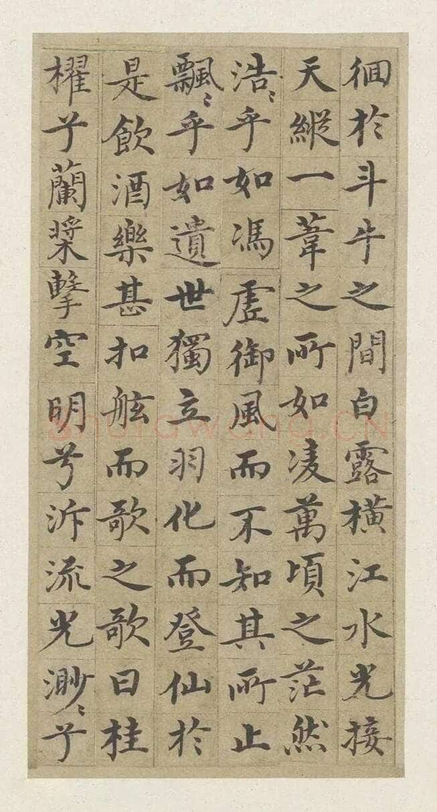

**明 沈度 《赤壁赋》**，间架结构，字形笔画都十分完美。相对来说易于欣赏。

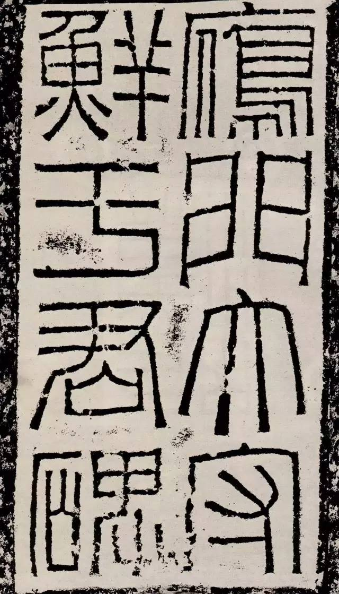

**东汉 《鲜于璜碑》 碑额**，方圆之间二者兼容，有力刚健，是另一种美感。

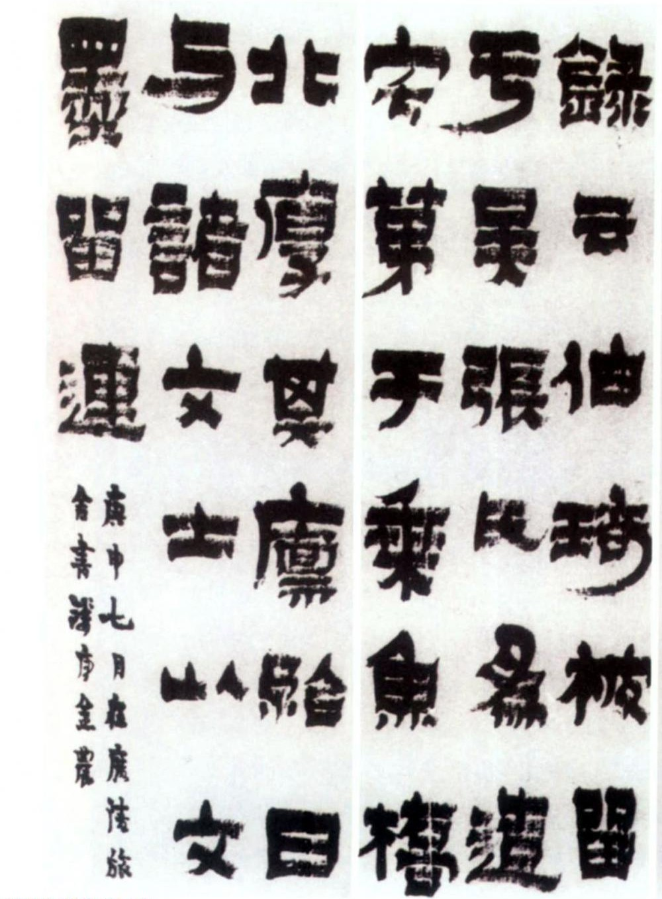

**清 金农 《漆书周伯琦传记六条屏》** ，初见可能觉得难以理解，但是一看就感觉被怔了一下，怔了就是有感觉了。体会笔与纸之间的摩擦力、触感、质感。

### 二、了解书法史上重要书法家及其作品

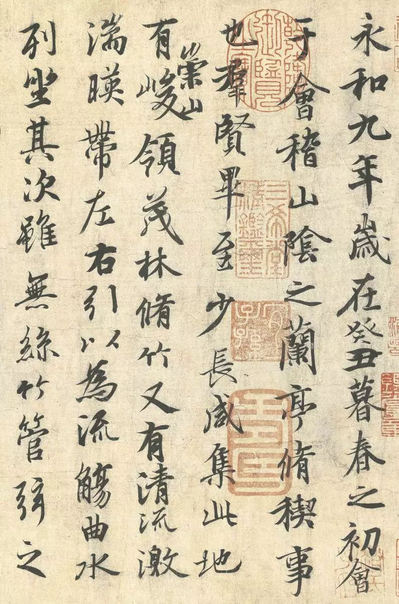

**晋 王羲之 《兰亭集序》 冯本**

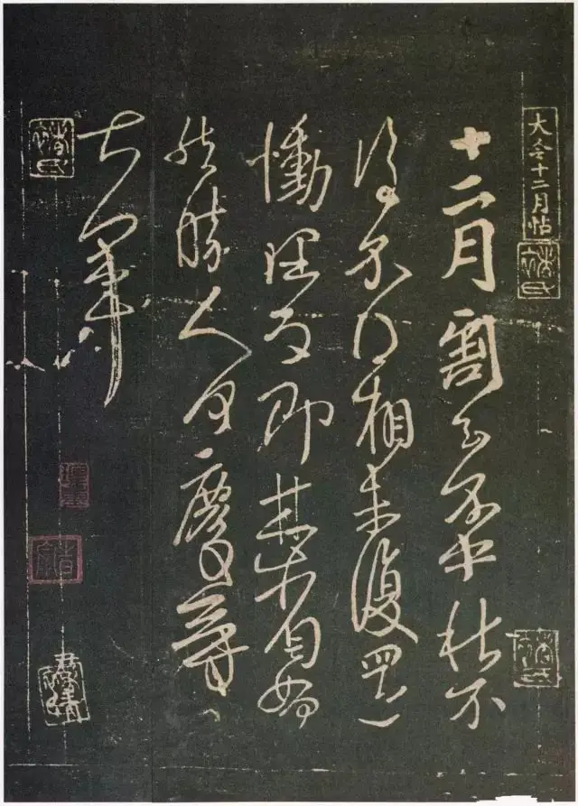

**晋 王献之 《十二月帖》** 相比其父更加狂放流畅，一笔书。

### 三、培养对书法艺术广阔而深入的认知、思考

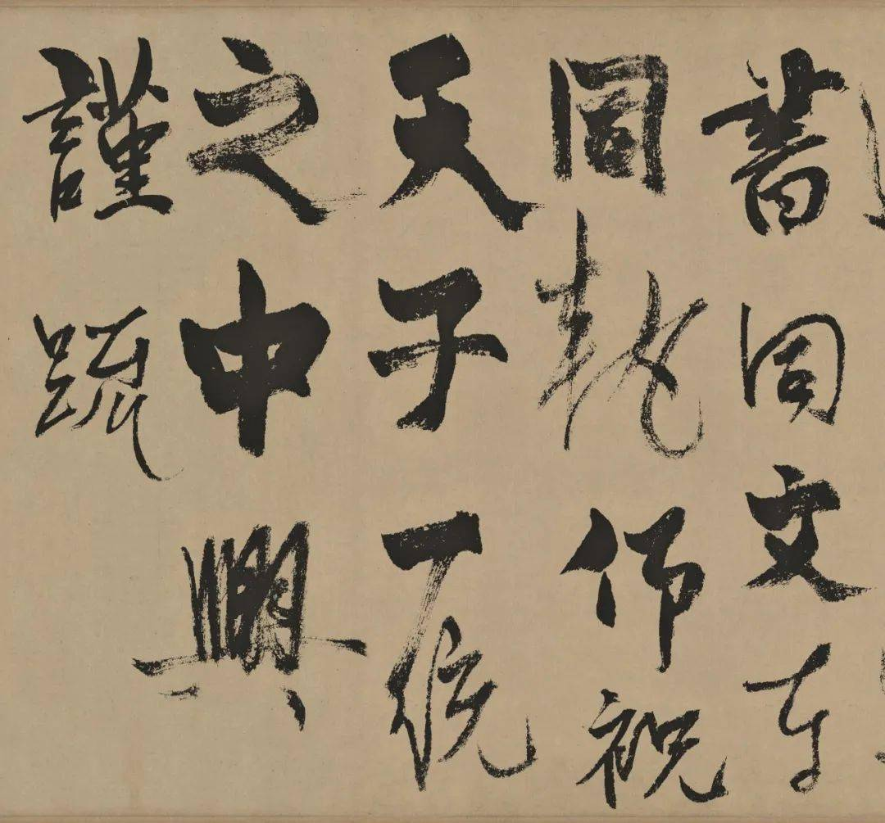

**元 杨维桢 《真镜庵募缘疏卷》** 以旧有的审美习惯或许难以接受，在学习这门课程之后，能逐渐理解。

### 四、学习书法的方法

抓大放小

### 五、让书法成为日常的一部分，体会书写的愉悦

## 课程目录

- **第一讲  书法的起源与汉字的构造** 

- **第二讲  书法五体，各有其美**

- **第三讲  书法的日常应用**

- **第四讲  点画（线条、块面）之美**

- **第五讲  节奏（音乐性、时间性）**

- **第六讲  章法与布白**

- **第七讲  神采和气息**

- **第八讲   骨、肉、血**

- **第九讲  个性与情绪**

- **第十讲  笔法（中锋、侧锋、八面出锋）**

- **第十一讲  “书写”的过程和意义**

- **第十二讲  临帖与创作**

- **第十三讲  必然与偶然**

- **第十四讲  意境与境界**

- **第十五讲  时代审美与个体选择**

  

- **第十六讲  《甲骨文》** 

- **第十七讲  《毛公鼎》**

- **第十八讲  《石鼓文》**

- **第十九讲  《汉简》**

- **第二十讲  《张迁碑》**

- **第二十一讲  钟繇《贺捷表》**

- **第二十二讲  王羲之《兰亭序》**

- **第二十三讲   王献之《鸭头丸帖》**

- **第二十四讲  北魏《始平公造像记》**

- **第二十五讲  《圣教序》二种**

- **第二十六讲  张旭《古诗四帖》**

- **第二十七讲  颜真卿《祭侄文稿》**

- **第二十八讲  苏轼《寒食诗帖》**

- **第二十九讲  黄庭坚《诸上座帖》**

- **第三十讲  米芾《珊瑚帖》**

## 书法的六个世界

- **笔墨**

  用笔、结字、章法、墨法

- **书写**

  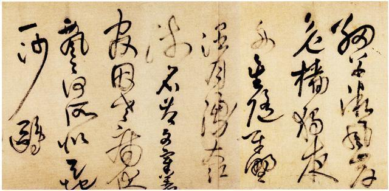

  **明 王铎 《草书唐诗十首长卷》** 快慢停走之间显现出书法的节奏感、韵律感，书写的不可逆、偶然与必然

- **性情**

  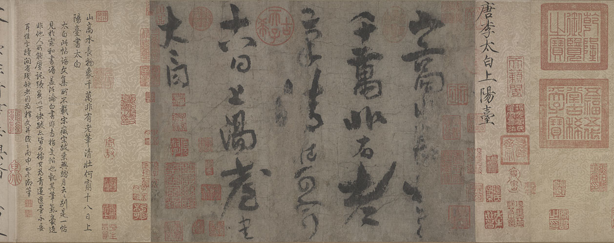

  **唐 李白 《上阳台帖》** 这是李白传世的唯一书迹。其落笔天纵，收笔处一放开锋，宋 黄庭坚评李白：“及观其稿书，大类其诗，弥使人远想慨然。白在开元、至德间，不以能书传，今其行、草殊不减古人。”(《山谷题跋》)。

  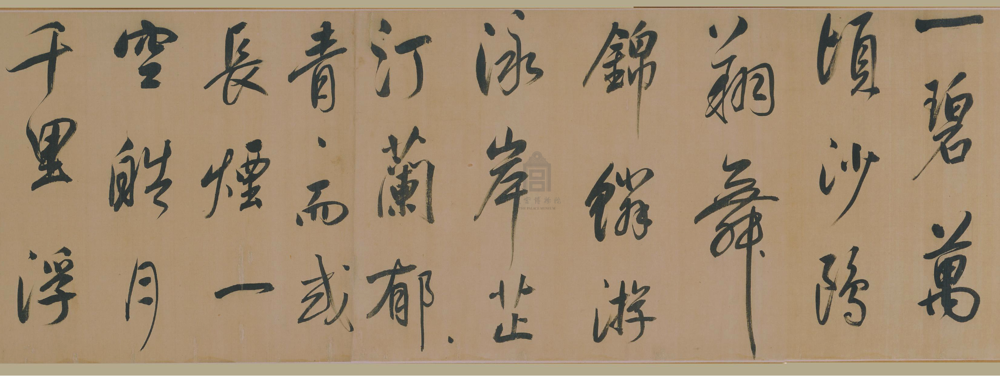

  **明 董其昌 《岳阳楼记》** 清新空灵，与李白书风截然不同。书写者的性格、情绪流露在书法之中。

  人的性情渗透在书法中，书法也会改变人，人书相鉴。

- **观念**

  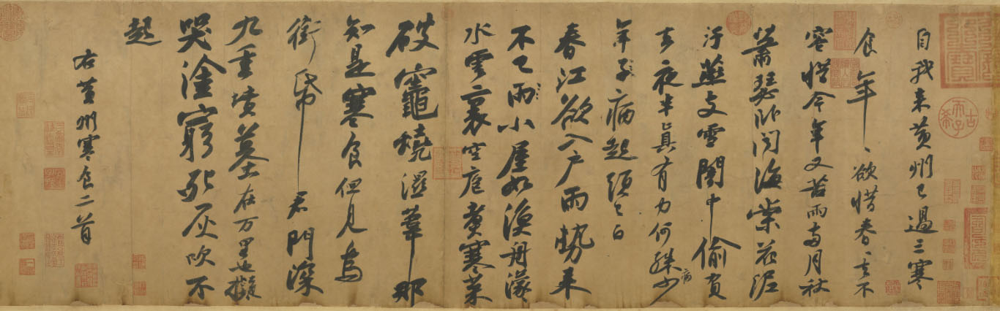

  **宋 苏轼 《黄州寒食诗帖》** 唐人主张 **“书贵瘦硬方通神”** ，苏轼主张 **“短长肥瘦各有态”** 。唐人重法度，宋人尚意，注重个人的意趣表达，亦可从文人画在宋朝的发展中窥见。这是个体的审美、时代的潮流、民族的思想的体现，审美主导实践。

- **生活**

  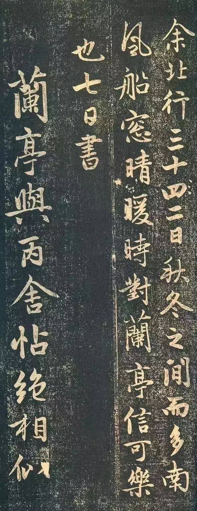

  **元 赵孟頫 《兰亭序十三跋》** 元至大三年，即公元1310年，赵孟頫时年五十七岁。这年九月，赵孟頫奉诏自吴兴（今浙江湖州）乘舟北上，前往大都（今北京）。船行至浙江南浔，为赵送行的独孤长老拿出一件《宋拓定武兰亭》。赵爱不释手，带去大都。同舟的吴森亦携有《定武兰亭》一本。此次北行，赵孟頫在舟中历时一月有余，旅途无事，得以赏玩两本《定武兰亭》，并对“独孤本”时时展读、临习，颇有心得，先后自九月五日至十月七日写下十三段跋文，后人称之为《兰亭序十三跋》。

  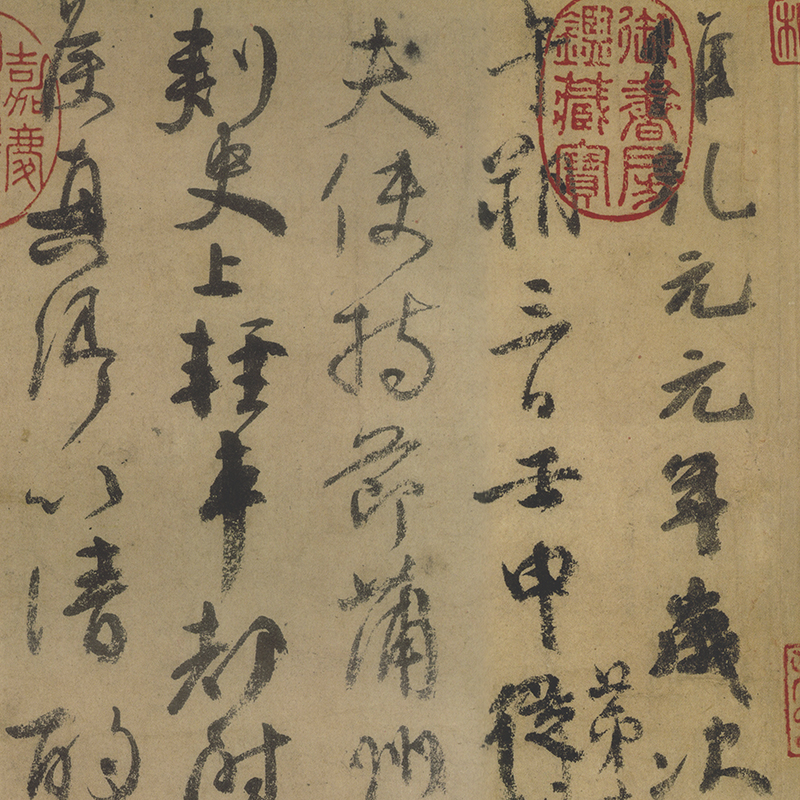

  **唐 颜真卿 《祭侄文稿》** 家国兴亡，字字泣血。人生经历的融入，书法背后的故事。

- **再造**

  美不自美，因人而彰（唐 柳宗元）。作品的流传与影响，后人的解读也是书法的一部分。

  **书法就是由这六个世界组成的。** 
